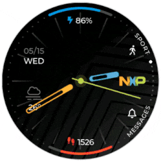

.. update 14.LVGL by hungnguyenduy
   lvgl using docs was written by Hung Nguyen Duy
   lvgl using SquareLine was written by Sang Huynh Thanh

####################################################################
LVGL
####################################################################

.. contents::
    :local:
    :depth: 3
    
********************************************************************
Tổng quan
********************************************************************

.. image:: images/lvgl_logo.png
   :align: center
   

LVGL là thư viện đồ họa nhúng mã nguồn mở và miễn phí phổ 
biến nhất để tạo giao diện người dùng đẹp mắt cho mọi MCU, MPU và loại màn hình. 
Nó được hỗ trợ bởi các nhà cung cấp và dự án hàng đầu trong ngành như Arm, STM32, NXP, 
Espressif, Nuvoton, Arduino, RT-Thread, Zephyr, NuttX, Adafruit và nhiều dự án khác.

Nó có tất cả các tính năng để tạo GUI hiện đại và đẹp mắt: hơn 30 tiện ích tích hợp, 
hệ thống kiểu dáng mạnh mẽ, trình quản lý bố cục lấy cảm hứng từ web và hệ thống kiểu 
chữ hỗ trợ nhiều ngôn ngữ. Để tích hợp LVGL vào nền tảng của mình, tất cả những gì bạn 
cần là RAM ít nhất 32kB và Flash 128 kB, trình biên dịch C, bộ đệm khung và ít nhất bộ 
đệm có kích thước màn hình 1/10 để hiển thị.

********************************************************************
Hướng dẫn cụ thể:
********************************************************************

Sử dụng Documents LVGL:
====================================================================

.. note:: Lưu ý: Project được build trên Window

Cấu trúc project LVGL:
--------------------------------------------------------------------
   * Cấu trúc thư mục của một project LVGL như sau::

      main.c
      CMakeLists.txt
      prj.conf
      app.overlay
      image.c
   * File ``app.overlay`` có thể có hoặc không do file này dùng để chèn thêm các config cho board mà mặc định zephyr không hổ trợ.
   * File ``prj.conf`` chứa đoạn mã cấu hình sau:

      .. code-block:: c

         CONFIG_LV_Z_MEM_POOL_SIZE=16384
         CONFIG_MAIN_STACK_SIZE=2048

         CONFIG_LV_FONT_MONTSERRAT_26=y
         CONFIG_LV_FONT_MONTSERRAT_14=y

         CONFIG_DISPLAY=y
         CONFIG_DISPLAY_LOG_LEVEL_ERR=y
         CONFIG_LOG=y
         CONFIG_SHELL=y

         CONFIG_LVGL=y
         CONFIG_LV_Z_SHELL=y
         CONFIG_LV_MEM_CUSTOM=y
         CONFIG_LV_USE_LOG=y
         CONFIG_LV_USE_LABEL=y
         CONFIG_LV_USE_BTN=y
         CONFIG_LV_USE_ARC=y
         CONFIG_LV_USE_IMG=y
         CONFIG_LV_USE_MONKEY=y

   * File ``CMakeLists.txt`` gồm:

      .. code-block:: c++

         # SPDX-License-Identifier: Apache-2.0

         cmake_minimum_required(VERSION 3.20.0)

         set(BOARD stm32f746g_disco)

         find_package(Zephyr REQUIRED HINTS $ENV{ZEPHYR_BASE})
         project(lvgl)

         target_sources(app PRIVATE main.c)

   .. note:: Lưu ý: File ``CMakeLists.txt`` trên đang build cho board `STM32F746G DISCO <https://developer.nordicsemi.com/nRF_Connect_SDK/doc/2.1.4/zephyr/boards/arm/stm32f746g_disco/doc/index.html>`__. 
      Nếu project có thêm file đuôi ``.c`` thì bạn chèn thêm lệnh ``target_sources(app PRIVATE 'tên file kèm đuôi')`` 

   * File ``image.c`` không bắt buộc phải có. Đối với những trường hợp cần có như khai báo 1 biến chứa bitmap ảnh cần hiển thị lên màn hình, bạn cần tạo file có đuôi ``.c`` . Để tạo file đó từ 1 hình ảnh cho trước. Đầu tiên `xóa phông nền ảnh <https://www.remove.bg/>`__ và chỉnh kích thước nếu cần. Sau đó sử dụng tools `Image Converter <https://lvgl.github.io/lv_img_conv/>`__ chọn hình cần chuyển đổi với thông số như **Color format** để là ``CF_TRUE_COLOR_ALPHA``,  thông số **File name(s)** đặt tên cho file, các thông số khác để mặc định và cuối cùng là nhấn bắt đầu chuyển đổi.

   .. note:: Lưu ý: Mục **File name(s)** đặt tên như nào thì tên biến sử dụng trong chương trình chính cũng chính là tên đó!
   
   .. _mainc_label:

   * File ``main.c`` chứa những đoạn lệnh cơ bản sau:

      .. code-block:: c
         :caption: main.c
         :linenos:

         #include <zephyr/device.h>
         #include <zephyr/devicetree.h>
         #include <zephyr/drivers/display.h>
         #include <zephyr/drivers/gpio.h>
         #include <lvgl.h>
         #include <stdio.h>
         #include <string.h>
         #include <zephyr/kernel.h>
         #include <lvgl_input_device.h>
         #include <zephyr/logging/log.h>
         #define LOG_LEVEL CONFIG_LOG_DEFAULT_LEVEL
         
         LOG_MODULE_REGISTER(app);
         
         /*****************Chèn function vào đây!*****************/
         
         int main(void)
         {
            const struct device *display_dev;
            
            display_dev = DEVICE_DT_GET(DT_CHOSEN(zephyr_display));
            if (!device_is_ready(display_dev)) {
               LOG_ERR("Device not ready, aborting test");
               return 0;
            }

            /*****************Gọi function tạo đối tượng màn hình ở đây!*****************/

            lv_task_handler();
            display_blanking_off(display_dev);

            while (1) {
               
            /*****************Chèn code vào đây!*****************/

               lv_task_handler();
               k_sleep(K_MSEC(10));
            }
         }

Ví dụ:
--------------------------------------------------------------------
* Để tạo một nút nhấn (button) với 1 sự kiện nào đó bạn làm như sau:

.. _samples_label:

   Từ tài liệu tham khảo trên `github <https://github.com/zephyrproject-rtos/lvgl>`__ tại mục ``/examples/widgets/btn/lv_example_btn_1.c`` ngoại trừ các 
   định nghĩa ``#define``, ``#ifdef``,... bạn chỉ sử dụng những đoạn chương trình con và các khai báo biến cần thiết. Sau đó chèn chúng vào chương 
   trình chính :ref:`main.c <mainc_label>` tại *line 15*:

   Tại *line 27* chúng ta gọi function ``lv_example_btn_1()`` để thực hiện tạo đối tượng. Đối với 
   function ``event_handler(lv_event_t * e)`` thì đây là một event sẽ xảy ra và được gọi ra xử lí nếu có 
   tác động tới đối tượng đó trên màn hình, cụ thể ở đây là nút nhấn nên bạn không cần gọi function này ra.

   Cuối cùng biên dịch chương trình và nạp ta được kết quả:
   
   .. image:: images/ex_btn.jpg
      :align: center
      :scale: 40%

   |br|
   
   .. note:: Lưu ý: Đối với các biến đối tượng ``lv_obj_t`` bạn nên khai báo dạng biến toàn cục, 
      vì có những trường hợp bạn cần lấy tham số thuộc đối tượng đó tại một event khác hoặc một đối tượng khác nào đó.

* Đối với đối tượng là hình ảnh:

   Bạn cần ``LV_IMG_DECLARE(img)`` (với ``img`` là tên biến cũng như tên file bạn đặt khi convert ở trên) trước khi sử dụng tới biến hình ảnh, ví dụ:

   .. code-block:: c
      :linenos:

      LV_IMG_DECLARE(logo_img);
      lv_obj_t * img1

      void lv_example_img_1(void)
      {
         img1 = lv_img_create(lv_scr_act());
         lv_img_set_src(img1, &logo_img);
         lv_obj_align(img1, LV_ALIGN_CENTER, 0, -20);
      }

   Với biến ``logo_img`` là tên file được đặt và convert ở bước trên. Tên file đầy đủ khi convert xong là ``logo_img.c``

   Biên dịch và nạp chương trình ta được kết quả:

   .. image:: images/ex_img.jpg
      :align: center
      :scale: 40%

.. note::
   Lưu ý: Ví dụ trên chỉ hướng dẫn sử dụng cho những mẫu có sẵn trên github. Để có thể tự tạo những đối tượng theo 
   ý mình, bạn cần tham khảo các mẫu có sẵn kết hợp nguồn có trong mục ``/src`` cùng với sự nhuần nhuyễn 
   khi tìm hiểu nhiều sẽ có thể tạo ra đối tượng mình muốn

Sử dụng công cụ hỗ trợ SquareLine Studio:
--------------------------------------------------------------------

   Công cụ này được sử dụng để hỗ trợ bạn trong quá trình tự custom project của mình như trích xuất các đoạn chương trình giao diện hoặc hiệu ứng... từ project SquareLine mà bạn đã Export.

- **Bước 1:** Cài đặt phần mềm SquareLine Studio.
- **Bước 2:** Sử dụng SquareLine Studio

   Sau các thao tác để tạo một giao diện trên SquareLine Studio, bạn import UI và xuất ra một cấu trúc file có dạng sau:

   .. image:: images/foldersqline.png
      :align: center

   Thư mục ``fonts`` chứa các file đuôi ``.c`` là các font dạng bitmap được sử dụng trong project SquareLine của bạn

   Thư mục ``screens`` chứa chương trình khởi tạo các đối tượng trên màn hình. Dựa vào đó bạn có thể xem cách mà SquareLine 
   khởi tạo và biên dịch ra từ những đối tượng trên màn hình, bạn có thể sử dụng những đối tượng đó và đặt chúng vào 
   trong một chương trình con (function) giống với những mẫu đã trình bày ở :ref:`trên <samples_label>`

   .. image:: images/sql_obj.png
      :align: center

   Ví dụ như hình trên ta có thể lấy một đoạn chương trình khởi tạo một ``label`` bỏ vào function, dĩ nhiên 
   nên khai báo biến đối tượng dạng toàn cục, cấu trúc chương trình có dạng sau:

   .. code-block:: c
      
      lv_obj_t * ui_Label_Date_3;

      void lv_example_img_1(void)
      {
         ui_Label_Date_3 = lv_label_create(lv_scr_act());
         lv_obj_set_width( ui_Label_Date_3, LV_SIZE_CONTENT);  /// 1
         lv_obj_set_height( ui_Label_Date_3, LV_SIZE_CONTENT);   /// 1
         lv_obj_set_align( ui_Label_Date_3, LV_ALIGN_BOTTOM_LEFT );
         lv_label_set_text(ui_Label_Date_3,"10:35  05 10 2022");
         lv_obj_set_style_text_color(ui_Label_Date_3, lv_color_hex(0x68727F), LV_PART_MAIN | LV_STATE_DEFAULT );
         lv_obj_set_style_text_opa(ui_Label_Date_3, 255, LV_PART_MAIN| LV_STATE_DEFAULT);
         lv_obj_set_style_text_font(ui_Label_Date_3, &lv_font_montserrat_12, LV_PART_MAIN| LV_STATE_DEFAULT);
      }

   File ``ui.c`` chứa các event và hiệu ứng các đối tượng trên màn hình
   
   File ``ui_helper.c`` chứa các function cần thiết của project đó.

Sử dụng SquareLine Studio:
====================================================================

...

.. |br| raw:: html

    

Tài liệu tham khảo:
====================================================================
   - https://github.com/zephyrproject-rtos/lvgl
   - https://docs.lvgl.io/master/overview/index.html

Phụ lục
====================================================================
* :ref:`search`
