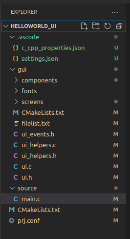

###########################################################################
LVGL
###########################################################################

LVGL(Light and Versatile Graphics Library) là thư viện đồ họa nhúng mã nguồn mở và miễn phí 
phổ biến nhất để tạo giao diện người dùng đẹp mắt cho mọi MCU, MPU và loại màn hình.
Tìm hiểu thêm tại `https://lvgl.io <https://lvgl.io/>`_.

.. contents::
    :local:
    :depth: 2

***************************************************************************
Hướng dẫn sử dụng SquareLine Studio
***************************************************************************
SquareLine Studio là trình chỉnh sửa giao diện, người dùng kéo và thả các thành phần đơn giản một cách trực quan 
để tạo giao diện người dùng đẹp mắt một cách nhanh chóng và dễ dàng cho các ứng dụng nhúng và máy tính để bàn.

===========================================================================
Cài đặt ứng dụng SquareLine Studio
===========================================================================
.. tabs::

   .. tab:: Windows

     - **Yêu cầu tối thiếu để cài đặt SquareLine Studio:**

      - Intel x64 PC with minimum:

       - CPU: Bộ xử lý Intel hoặc AMD có hỗ trợ 64-bit, bộ xử lý 1,5 GHz hoặc nhanh hơn
       - RAM: 4 GB
       - HDD: 2 GB
       - GPU: Hỗ trợ DirectX 11 hoặc OpenGL 3.2

      - Hệ điều hành:

       - Hệ điều hành: Windows 7 trở lên (64-bit)
       - Độ phân giải màn hình: 1280 x 800
       - Cần có kết nối internet để kích hoạt phần mềm

     - **Tiến hành cài đặt:**

      `Bước 1`: Tải file cài đặt: truy cập vào `Link <https://squareline.io/downloads>`_ và tải file cài đặt dành cho Windows

      `Bước 2`: Chạy file SquareLine_Studio_Setup.exe để cài đặt ứng dụng. Làm theo hướng dẫn để hoàn tất quá trình cài đặt

   .. tab:: Linux

     - **Yêu cầu tối thiếu để cài đặt SquareLine Studio:**

      - Intel x64 PC with minimum:

       - CPU: Bộ xử lý Intel hoặc AMD có hỗ trợ 64-bit, bộ xử lý 1,5 GHz hoặc nhanh hơn
       - RAM: 4 GB
       - HDD: 2 GB
       - GPU: Hỗ trợ Vulcan hoặc OpenGL 3.2

      - Hệ điều hành:

       - Hệ điều hành: Ubuntu 18.04 hoặc mới hơn
       - Độ phân giải màn hình: 1280 x 800
       - Cần có internet để kích hoạt phần mềm

     - **Tiến hành cài đặt:**

      `Bước 1`: Tải file cài đặt: truy cập vào `Link <https://squareline.io/downloads>`_ và tải file cài đặt dành cho Linux

      `Bước 2`: Giải nén file vừa tải

      `Bước 3`: Chạy file setup.sh

        - Mở terminal truy cập vào thư mục có chứa file setup.sh
        - Chạy các lệnh sau.

      .. code-block:: bash

         chmod +x setup.sh
         ./setup.sh

   .. tab:: macOS

     - **Yêu cầu tối thiếu để cài đặt SquareLine Studio:**

      - Intel x64 PC with minimum:
  
       - CPU: Intel or AMD processor with 64-bit support, 1.5 GHz or faster processor
       - RAM: 4 GB
       - HDD: 2 GB of storage space
       - GPU: Hỗ trợ Metal hoặc OpenGL 3.2

      - Hệ điều hành:

       - Hệ điều hành: High Sierra 10.13 hoặc mới hơn
       - Độ phân giải màn hình: 1280 x 800
       - Cần có kết nối internet để kích hoạt phần mềm

     - **Tiến hành cài đặt:**

      `Bước 1`: Tải file cài đặt: truy cập vào `Link <https://squareline.io/downloads>`_ và tải file cài đặt dành cho macOS

      `Bước 2`: Khởi chạy SquareLineStudio, chấp nhận Điều khoản và Điều kiện và bạn đã sẵn sàng sử dụng phần mềm.
      Nếu bạn có CPU dựa trên ARM (ví dụ Apple M1) thì bạn nên sử dụng Rosetta.
      Tim hiểu thêm ở đây: `https://support.apple.com/en-us/HT211861 <https://support.apple.com/en-us/HT211861>`_

.. note::
   Lưu ý: Nếu xảy ra lỗi thiếu thư viện thì các bạn cài thêm cho máy (Bổ sung một số lỗi có thể gặp sau).

===========================================================================
Sử dụng ứng dụng SquareLine Studio
===========================================================================

- Mở ứng dụng SquareLine Studio
- Đăng nhập
  
  Nếu bạn chỉ muốn dùng thử chương trình, bạn không cần phải đăng ký hoặc đăng nhập.
  Trong trường hợp bạn chưa sử dụng SquareLine Studio trên máy tính,
  bạn sẽ tự động nhận được phiên bản dùng thử 30 ngày.
  
  Nếu bạn muốn sử dụng lâu dài hãy mua giấy phép (license) và đăng nhập.
  Sau đó, bạn có thể tạo một dự án mới, tải dự án đã lưu của mình hoặc
  làm việc với một ví dụ có sẵn trong SquareLine Studio.

- Mở dự án đã lưu hoặc tải về trước đó
  
   .. image:: img/img1.png
      :align: center
      :alt: error image

  Nhấn **Improt Project** để tải một dự án đã được lưu trên máy tính

- Tạo dự án mới

   .. image:: img/img2.png
      :align: center
      :alt: error image

  - **Board Description** - Mô tả board được chọn.
  - **Project Description** - Mô tả dự án của bạn.
  - **Project Settings** - Tạo tên, đường dẫn và độ phân giải của dự án của bạn.
  - **Create Project** - Sau khi thêm tất cả các tham số cần thiết, bạn có thể tạo dự án của mình.

- Mở dự án mẫu của SquareLine Studio cung cấp

   .. image:: img/img3.png
      :align: center
      :alt: error image
  
   Để sử dụng một dự án mẫu, chỉ cần chọn một dự án thích hợp từ danh sách và 
   tải nó bằng cách nhấp **CREATE**

- Xuất dự án giao diện sau khi thiết kế trên SquareLine Studio

   .. image:: img/img4.png
      :align: center
      :alt: error image

   Nhấn **Export** -> **Export UI Files**, sau đó chọn thư mục sẽ chứa dự án giao diện đó.

===========================================================================
Thêm chương trình giao diện vào chương trình chính của dự án
===========================================================================

- Tạo một thư mục ``gui`` trong dự án, đồng cấp với thư mục ``source`` để
  chứa các file giao diện vừa thiết kế trên SquareLine Studio

   .. image:: img/img5.png
      :align: center
      :alt: error image

- Thay đổi đường dẫn file thư viện ``lvgl.h`` trong file ``ui.h``

   .. image:: img/img6.png
      :align: center
      :alt: error image

   .. image:: img/img7.png
      :align: center
      :alt: error image

- Thêm thư viện ``ui.h`` vào trong file ``main.c``

   .. image:: img/img8.png
      :align: center
      :alt: error image

- Chỉnh sửa file ``CMakeLists.txt`` cùng cấp với folder ``src`` như sau:

   .. code-block:: cmake

      cmake_minimum_required(VERSION 3.20.0)
      find_package(Zephyr REQUIRED HINTS $ENV{ZEPHYR_BASE})
      project(_htsang_ui_button)
      FILE(GLOB app_sources source/*.c)
      target_sources(app PRIVATE ${app_sources})
      include_directories(gui)
      target_sources(app PRIVATE gui/ui_helpers.c)
      target_sources(app PRIVATE gui/ui.c)
      target_sources(app PRIVATE gui/components/ui_comp_hook.c)
      target_sources(app PRIVATE gui/screens/ui_Screen1.c)

- Thêm cấu hình trong file ``prj.conf`` cùng cấp với folder ``src`` như sau:
  
   .. code-block:: linux-config

      # LVGL
      CONFIG_LVGL=y
      CONFIG_LV_Z_MEM_POOL_SIZE=8192
      # Display
      CONFIG_DISPLAY=y
      CONFIG_INPUT=y

***************************************************************************
Hello World với SquareLine Studio
***************************************************************************
.. note::
   Hướng dẫn này được chạy trên board `STM32F746G_Disco <https://www.st.com/en/evaluation-tools/32f746gdiscovery.html>`_

===========================================================================
Thiết kế giao diện trên SquareLine Studio
===========================================================================

- Tạo dự án mới

   Tạo dự án mới phần cứng STxxxx, kích thước màn hình là 480x272 và chế độ màu 16bits

- Thêm nút nhấn (button):
  
   Nhấn đúp vào biểu tượng nút nhấn (**Button**) trên bảng Widgets.
   Khi đó, màn hình giao diện sẽ hiển thị ra một nút nhấn có tên là **Button1** kích thước mặc định rộng 100px và dài 50px
   tại vị trí trung tâm màn hình (trung tâm của thành phần mẹ). 

- Thay đổi thuộc tính cho nút nhấn **HelloButton1**:

   Đổi tên, kích thước...

- Thiết lập sự kiện cho nút nhấn:

   * Bước 1: Ở mục Event, nhấn vào nút **ADD EVENT**

   * Bước 2: Chọn hành động khi sự kiện kích hoạt. Ở đây chọn hoạt động **MODIFY STATE** (biến đổi trạng thái). Sau đó nhấn **ADD**

   * Bước 3: Thay đổi tên cho sự kiện, chọn hành động kích hoạt sự kiện. Chọn đối tượng (**HelloButton**), trạng thái (**CHECKED**) và kiểu chuyển trạng thái (**TOGGLE**) cho hoạt động biến đổi trạng thái

   .. image:: img/helloworld_img/HelloWorld3.png
      :align: center
      :alt: error image

- Thiết kế nút nhấn khi ở trạng thái **CHECKED**:
  
   Chuyển trạng thái nút nhấn sang **CHECKED**
   
   .. image:: img/helloworld_img/HelloWorld4.png
      :align: center

   Thiết lập thuộc tính cho trạng thái **CHECKED**: Ở đây chỉ chỉnh nền thành màu đỏ
   
   .. image:: img/helloworld_img/HelloWorld5.png
      :align: center

- Tạo nhãn dán cho nút nhấn (**Label**):

   Nhấn đúp vào biểu tượng nhãn dán (**Label**) trên bảng Widgets.
   Khi đó, một nhãn dán tên **Label1** sẽ được tạo ra với nội dung *text*
   Sau đó, kéo **Label1** thả vào HelloButton để thay đổi cấp cho **Label1** (khi đó **Lable1** sẽ là con của **HelloButton**)
   
   .. image:: img/helloworld_img/HelloWorld7.png
      :align: center

- Thay đổi thuộc tính cho nhãn dán **HelloButton1**:

   Chỉnh sửa nội dung nhãn dán thành *HELLO WORLD*

   .. image:: img/helloworld_img/HelloWorld8.png
      :align: center

- Chạy mô phỏng giao diện:

   .. image:: img/helloworld_gif/demo_in_SquareLine.gif
      :align: center

- Xuất bản thiết kế giao diện:

   .. image:: img/helloworld_img/HelloWorld_export.png
      :align: center

===========================================================================
Cấu trúc chương trình (Cây thư mục)
===========================================================================

===========================================================================
File ``main.c``
===========================================================================
   .. code-block:: C

      #include <stdio.h>
      #include <stdint.h>
      #include <zephyr/drivers/display.h>
      #include <zephyr/kernel.h>
      #include <zephyr/logging/log.h>
      #include <lvgl.h>
      #include <zephyr/device.h>
      #include "../gui/ui.h"

      LOG_MODULE_REGISTER(app);

      int main(void)
      {
         const struct device *display_dev;
         display_dev = DEVICE_DT_GET(DT_CHOSEN(zephyr_display));
         if (!device_is_ready(display_dev)) {
            return 0;
         }
         ui_init();
         lv_task_handler();
         display_blanking_off(display_dev);

         while (1)
         {
            k_msleep(lv_task_handler());
         }
         return 0;
      }

===========================================================================
File ``prj.conf``
===========================================================================
   .. code-block:: kernel-config

      # Main config
      CONFIG_MAIN_STACK_SIZE=2048
      CONFIG_LOG=y

      # LVGL
      CONFIG_LVGL=y
      CONFIG_LV_Z_MEM_POOL_SIZE=8192

      # Display
      CONFIG_DISPLAY=y
      CONFIG_INPUT=y

      # Power management
      CONFIG_PM=y

      # Build 
      CONFIG_SIZE_OPTIMIZATIONS=y

      CONFIG_ARM_MPU=n

===========================================================================
File ``CMakeList.txt``
===========================================================================
   .. code-block:: cmake

      cmake_minimum_required(VERSION 3.20.0)

      find_package(Zephyr REQUIRED HINTS $ENV{ZEPHYR_BASE})
      project(HELLOWORLD_UI)

      FILE(GLOB app_sources source/*.c)
      target_sources(app PRIVATE ${app_sources})

      include_directories(gui)

      target_sources(app PRIVATE gui/ui_helpers.c)
      target_sources(app PRIVATE gui/ui.c)
      target_sources(app PRIVATE gui/components/ui_comp_hook.c)
      target_sources(app PRIVATE gui/screens/ui_Screen1.c)

===========================================================================
Kết quả chạy trên `STM32F746 Discovery Kit <https://www.st.com/en/evaluation-tools/32f746gdiscovery.html>`_
===========================================================================

   .. image:: img/img9.png
      :align: center

Kích hoạt môi trường ảo cho zephyr:

   .. code-block:: bash

      source ~/zephyrproject/.venv/bin/activate

Di chuyển địa chỉ terminal đến folder của dự án và tiến hành build chương trình:

   .. code-block:: bash

      west build -p always -b stm32f746g_disco

Sau khi build xong, tiến hành fash vào board:

   .. code-block:: bash

      west flash

Kết quả thực tế:

   .. image:: img/helloworld_gif/HelloWord_in_STM32F746_Disco.gif
      :align: center

