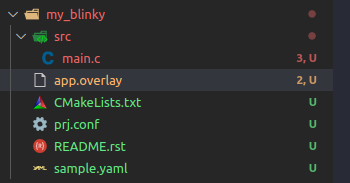
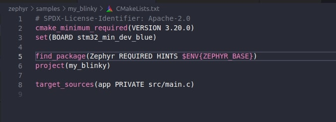
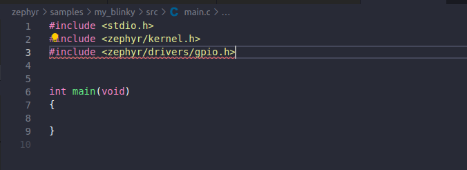

Giới thiệu
==========

Trong phần này chúng ta sẽ tìm hiểu về GPIO cơ bản:
    * Thiết lập chân input
    * Thiết lập chân output
    * Thiết lập chân ngắt

Cài đặt GPIO
============
1.Tạo project
~~~~~~~~~~~~~

Để tạo project nhanh nhất ta copy project **blinky** trong ``zephyr/samples/basic`` đổi tên thành **my_blinky**.
Xóa thư mục ``build`` nếu có. Tạo file app.overlay. 

Ở đây chúng ta sẽ sử dụng board **stm32f103C8T6** nên trong file ``CMakeLists.txt`` ta
thêm vào ``set (BOARD stm32_min_dev_blue)`` theo thứ tự dưới đây. Lúc build project ta chỉ cần gõ lệnh ``west build``.

2.Cấu hình GPIO sử dụng app.overlay
~~~~~~~~~~~~~~~~~~~~~~~

Device tree (DTS) được sử dụng để mô tả phần cứng của bo mạch. Ta có thể dùng ``led pc13`` trên board. 
Nhưng ở đây ta sẽ cấu hình một led mới.
Ta tạo file app.overlay để  cấu hình ``LED1`` và ``BUTTON`` theo dưới đây.

.. code-block:: dts

        / {
        leds {
            red_led: led_1 {
                gpios = <&gpioa 8 GPIO_ACTIVE_HIGH>;
                label = "LD1";
            };
        };

        buttons {
            compatible = "gpio-keys";
            button0: button_0 {
                gpios = <&gpioa 1 (GPIO_PULL_UP | GPIO_ACTIVE_HIGH)>;
                label = "User button";
            };
        };
        aliases {
            sw0 = &button0;
            led1 = &red_led;
        };
    };    

Ta có:
    * ``gpioa`` là Port
    * ``8`` là Pin
    * ``GPIO_ACTIVE_HIGH`` là Flag

.. note::

    ``GPIO_ACTIVE_HIGH`` đơn giản chỉ là một cờ để chỉ định rằng chân GPIO được coi là "active" khi ở trạng thái logic cao.

    ``GPIO_ACTIVE_LOW`` đơn giản chỉ là một cờ để chỉ định rằng chân GPIO được coi là "active" khi ở trạng thái logic thấp.

3.Đặt tên cho các nút GPIO
~~~~~~~~~~~~~~~~~~~~~~~

Vào main.c xóa và chỉ để lại những dòng sau:

thiết lập các #define cho led và button để tiện sử dụng sau này.

.. code-block:: C

    //Macro DT_ALIAS dùng để lấy nhãn của button/led
    #define LED1_NODE    DT_ALIAS(led1)
    #define BUTTON0_NODE DT_ALIAS(sw0)
    
4.Lấy thông tin cấu hình GPIO(số chân GPIO, cấu hình pull-up,pull-down,v.v..)
~~~~~~~~~~~~~~~~~~~~~~~~~~~~~

.. code-block:: C

    static const struct gpio_dt_spec led = GPIO_DT_SPEC_GET(LED1_NODE, gpios);

    static const struct gpio_dt_spec button = GPIO_DT_SPEC_GET_OR(BUTTON0_NODE, gpios, {0});

5.Cấu hình GPIO(input/output)
~~~~~~~~~~~~~~~

.. code-block:: C

    int ret1,ret2,ret3;

    ret1 = gpio_pin_configure_dt(&led, GPIO_OUTPUT_ACTIVE); // chân output

    ret2 = gpio_pin_configure_dt(&button, GPIO_INPUT | GPIO_PULL_UP); // chân input

    ret3 = gpio_pin_interrupt_configure_dt(&button,GPIO_INT_EDGE_FALLING); // chân ngắt cạnh xuống
   

6.Các hàm trong GPIO
~~~~~~~~~~~~~~~~~~~~~~~

* Set 

.. code-block:: C

    gpio_pin_set_dt(&led, 0);// đặt chân ra led ở mức logic 0

* Get

.. code-block:: C

    gpio_pin_get_dt(&button);// lấy mức logic của nút nhấn

* Toggle

.. code-block:: C

    gpio_pin_toggle_dt(&led);// thay đổi mức logic của led

