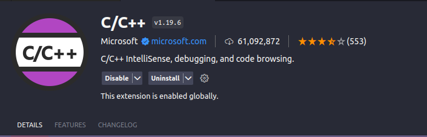
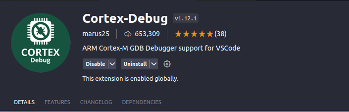
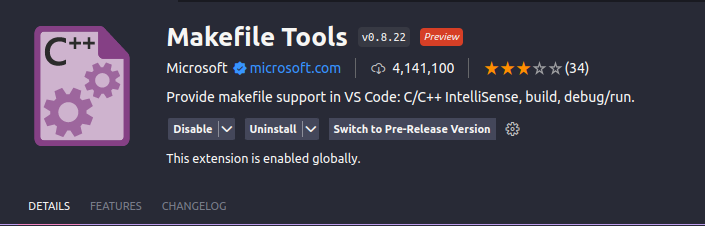
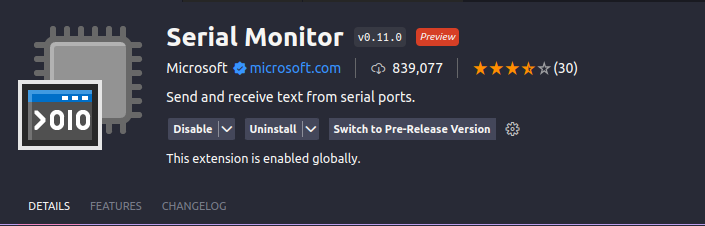
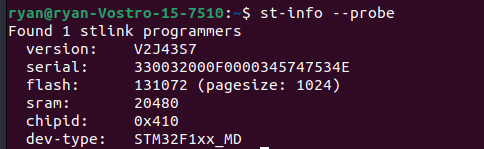

DEBUG
=====

.. contents::
    :local:
    :depth: 2

1.Cài đặt compiler cho stm32
~~~~~~~~~~~~~~~~~~~~~~~~~~~~

.. code-block:: 

    sudo apt-get install git build-essential gcc-arm-none-eabi libtool libusb-1.0.0 libusb-1.0-0-dev gdb-multiarch 

2.Cài đặt openOCD
~~~~~~~~~~~~~~~~~

.. code-block:: 

    sudo apt-get update 
    sudo apt-get upgrade
    git clone https://github.com/openocd-org/openocd.git

    cd openocd
    ./bootstrap
    ./configure --prefix=/usr/local/ --enable-ftdi --enable-stlink
    sudo make install

3.Cài các extension
~~~~~~~~~~~~~~~~~~~

4.Cài St-link
~~~~~~~~~~~~~

.. code-block:: 

    sudo apt install stlink-tools

Cắm St-link vào máy và kiểm tra theo lệnh và cho ra như hình bên dưới là thành công

.. code-block:: 

    st-info --probe

5.Tạo folder .vscode để debug
~~~~~~~~~~~~~~~~~~~~~~~~~~~~~

Tạo file setting.json trong folder với nội dung sau, sửa ``ryan`` theo user trên máy của mình.

.. code-block:: json

    {
    "terminal.integrated.env.windows":
    {
        
        "PATH": "/home/ryan/zephyrproject/zephyr/scripts;${env:PATH}",
        "ZEPHYR_BASE": "/home/ryan/zephyrprojec/zephyr"
    }
    }

Tạo file launch.json trong folder với nội dung sau, sửa ``ryan`` theo user trên máy của mình.

.. code-block:: 

    {
    "version": "0.2.0",
    "configurations":
    [
        {
            "gdbPath": "/home/ryan/zephyr-sdk-0.16.4/arm-zephyr-eabi/bin/arm-zephyr-eabi-gdb",
            "cwd": "${workspaceRoot}",
            "executable": "${workspaceFolder}/build/zephyr/zephyr.elf",
            "name": "Debug with OpenOCD",
            "request": "launch",
            "type": "cortex-debug",
            "servertype": "openocd",
            "configFiles": ["/home/ryan/zephyrproject/zephyr/boards/arm/stm32_min_dev/support/openocd.cfg"],
            "searchDir": [],
            "runToEntryPoint": "main",
            "showDevDebugOutput": "none"
        },
        
    ]
    }

.. note::

    Nếu sử dụng board khác stm32_min_dev thì vào thư mục support của board đó và copy đường dẫn ``openocd.cfg`` thay vào ``configFiles`` ở trên.

