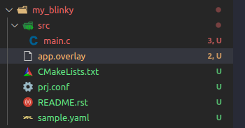
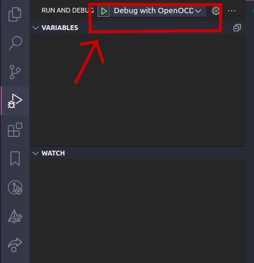
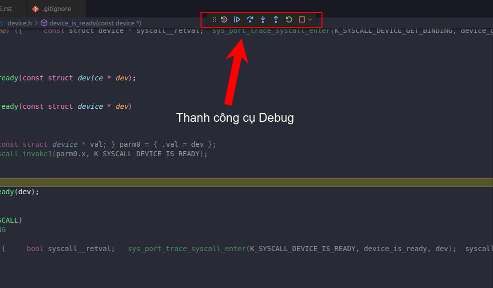
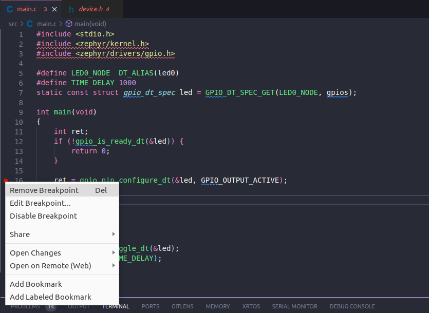
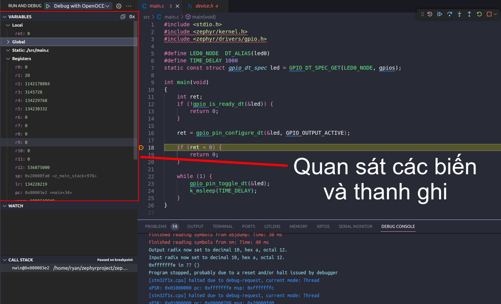

DEBUG
=====

.. contents::
    :local:
    :depth: 2

1. Cài đặt compiler cho stm32
~~~~~~~~~~~~~~~~~~~~~~~~~~~~

.. code-block:: 

    sudo apt-get install git build-essential gcc-arm-none-eabi libtool libusb-1.0.0 libusb-1.0-0-dev gdb-multiarch 

2. Cài đặt openOCD
~~~~~~~~~~~~~~~~~

.. code-block:: 

    sudo apt-get update 
    sudo apt-get upgrade
    git clone https://github.com/openocd-org/openocd.git

    cd openocd
    ./bootstrap
    ./configure --prefix=/usr/local/ --enable-ftdi --enable-stlink
    sudo make install

3. Cài các extension
~~~~~~~~~~~~~~~~~~~

.. image:: ../Image/serialmonitor.png

4. Cài St-link
~~~~~~~~~~~~~

.. code-block:: 

    sudo apt install stlink-tools

Cắm St-link vào máy và kiểm tra theo lệnh và cho ra như hình bên dưới là thành công

.. code-block:: 

    st-info --probe

5. Tạo folder .vscode để debug
~~~~~~~~~~~~~~~~~~~~~~~~~~~~~

.. note:: 

    Một folder ``.vscode`` chỉ sử dụng cho một folder project duy nhấT

* **Tạo file setting.json trong folder với nội dung sau, sửa ``ryan`` theo user trên máy của mình.**

.. code-block:: json

    {
    "terminal.integrated.env.windows":
    {
        
        "PATH": "/home/ryan/zephyrproject/zephyr/scripts;${env:PATH}",
        "ZEPHYR_BASE": "/home/ryan/zephyrprojec/zephyr"
    }
    }

* **Tạo file launch.json trong folder với nội dung sau, sửa ``ryan`` theo user trên máy của mình.**

.. note::

    Nếu sử dụng board khác stm32_min_dev thì vào thư mục support của board đó và copy đường dẫn ``openocd.cfg`` thay vào ``configFiles`` ở trên.

.. code-block:: 

    {
    "version": "0.2.0",
    "configurations":
    [
        {
            "gdbPath": "/home/ryan/zephyr-sdk-0.16.4/arm-zephyr-eabi/bin/arm-zephyr-eabi-gdb",
            "cwd": "${workspaceRoot}",
            "executable": "${workspaceFolder}/build/zephyr/zephyr.elf",
            "name": "Debug with OpenOCD",
            "request": "launch",
            "type": "cortex-debug",
            "servertype": "openocd",
            "configFiles": ["/home/ryan/zephyrproject/zephyr/boards/arm/stm32_min_dev/support/openocd.cfg"],
            "searchDir": [],
            "runToEntryPoint": "main",
            "showDevDebugOutput": "none"
        },
        
    ]
    }

6. Cách thực hiện debug
~~~~~~~~~~~~~~~~~~~~~~~~~~~~~

.. note:: 
    
    Trước khi bắt đầu debug:

    * Cắm st-link vào máy
    * Thực hiện build project 

* **Nhấn vào biểu tượng debug ở thanh bên trái**

.. image:: ../Image/debugbutton.png

* **Nhấn nút debug màu xanh để debug với OpenOCD**

* **Thanh công cụ**

* **Đặt breakpoint (thông thường ta đặt breakpoint để nhảy tới vị trí ta cần kiểm tra để đẩy nhanh quá trình debug, chủ yếu là các hàm callback của ngắt)**
Click chuột phải và chọn ``Add Breakpoint``. Muốn remove ta cũng click chuột phải và chọn ``Remove Breakpoint``.

.. image:: ../Image/addbp.png

* **Nơi theo dõi các biến và thanh ghi**

