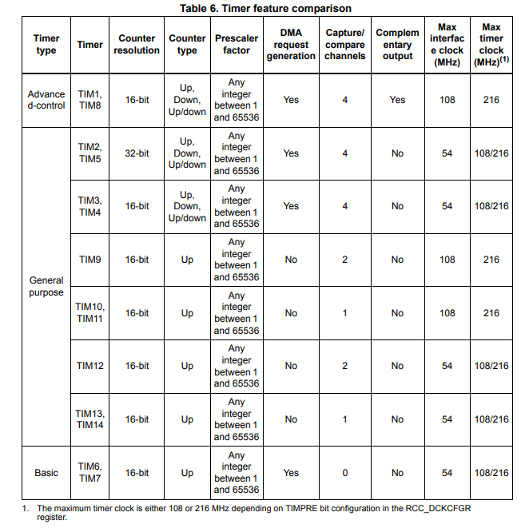

Timers in STM32F746G - DISCO
============================

Board có 2 advanced-control timers, 8 general-purpose timers, 2 timers cơ bản và 2 watchdog timers.

Tất cả timer có thể tạm dừng khi debug

Advanced-control timers (TIM1, TIM8)
------------------------------------

Advanced-control timers (TIM1, TIM8) có 4 kênh độc lập được sử dụng cho:

* Input capture

* Output compare

* PWM generation

* One-pulse mode output

Nếu được cấu hình là một timer 16-bit tiêu chuẩn, thì các timer này sẽ hoạt động giống như một general-purpose TIMx timers. Nếu cấu hình là một bộ tạo xung PWM 16-bit thì các timer có đầy đủ chức năng.

TIM1 và TIM8 có hỗ trợ DMA

General-purpose timers (TIMx)
-----------------------------

TIM2, TIM3, TIM4, TIM5
~~~~~~~~~~~~~~~~~~~~~~

STM32F74xxx bao gồm 4 bộ timers general-purpose đầy đủ chức năng TIM2, TIM5, TIM3, và TIM4.

* TIM2 và TIM5 dựa trên cơ chế  32-bits auto-reload, bộ đếm lên/xuống và bộ prescaler 16-bit.

* TIM3 và TIM4 dựa trên cơ chế  16-bits auto-reload, bộ đếm lên/xuống và bộ prescaler 16-bit.

Tất cả chúng đều có 4 kênh độc lập: input capture/output compare, PWM hoặc one-pulse mode output.

TIM9, TIM10, TIM11, TIM12, TIM13, and TIM14
~~~~~~~~~~~~~~~~~~~~~~~~~~~~~~~~~~~~~~~~~~~

Các timer này dựa trên bộ 16-bit auto-reload upcounter and a 16-bit prescaler. TIM10, TIM11, TIM13, và TIM14 
có một kênh độc lập, trong khi TIM9 và TIM12 có hai kênh độc lập để input capture/output compare, PWM hoặc one-pulse mode output.
Chúng có thể được đồng bộ hóa với general-purpose timers TIM2, TIM3, TIM4, TIM5. Chúng cũng có thể được dùng để làm time base.

TIM2, TIM3, TIM4, TIM5 hỗ trợ DMA.

Basic timers TIM6 and TIM7
~~~~~~~~~~~~~~~~~~~~~~~~~~

Những bộ định thời này chủ yếu được sử dụng để kích hoạt DAC và tạo dạng sóng. Chúng cũng có thể được sử dụng làm time-base 16 bit chung.

TIM6 và TIM7 hỗ trợ DMA.

SysTick timer
~~~~~~~~~~~~~

Timer dành riêng cho các hệ điều hành thời gian thực, nhưng cũng có thể được sử dụng làm bộ đếm ngược tiêu chuẩn. Chức năng của nó:

* 24-bit downcounter

* Auto-reload

* Việc tạo ngắt hệ thống khi bộ đếm đạt 0

