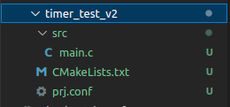

Examples
========

Blink led_0 trên board STM332F746G_Disco step by step
-----------------------------------------------------

* Bước 1: Tạo một project với đủ các file như hình.

* Bước 2: Viết file CMakeLists.txt giống với các sample cơ bản của zephyr.

.. code-block:: 

    # SPDX-License-Identifier: Apache-2.0

    cmake_minimum_required(VERSION 3.20.0)

    find_package(Zephyr REQUIRED HINTS $ENV{ZEPHYR_BASE})
    project(timer_test_v2)

    FILE(GLOB app_sources src/*.c)
    target_sources(app PRIVATE ${app_sources})

* Bước 3: Config cho board của bạn theo ứng dụng bạn muốn sử dụng.

.. code-block:: c
   
   CONFIG_PWM=y

   CONFIG_LED=y

   CONFIG_STDOUT_CONSOLE=y
   CONFIG_PRINTK=y
   CONFIG_LOG=y

* Bước 4: Hoàn thành đoạn code sau.

.. code-block:: c

    #include <zephyr/kernel.h>
    #include <zephyr/sys/printk.h>
    #include <zephyr/drivers/gpio.h>

    #define LED0_NODE DT_ALIAS(led0)

    static const struct gpio_dt_spec led = GPIO_DT_SPEC_GET(LED0_NODE, gpios);

    struct k_timer my_timer;
    extern void my_expiry_function(struct k_timer *timer_id, bool led_state);

    void my_expiry_function(struct k_timer *timer_id, bool led_state)
    {
        gpio_pin_toggle_dt(&led);
        led_state = !led_state;
        printk("timeout %d\n", k_cycle_get_32());
    }

    int main(void)
    {
        bool led_state = true;

        k_timer_init(&my_timer, my_expiry_function, NULL);

        k_timer_start(&my_timer, K_MSEC(5000), K_MSEC(1000));
        
    }

* Bước 5: Quan sát kết quả.

Sử dụng hàm Timer Expiry
------------------------

Đoạn code sau sử dụng timer để thực hiện một hành động không theo chu kì bình thường. Một khi công việc được yêu cầu không thể hoàn thành tại một level ngắt, hàm hết hạn (expriry function) của timer một 

.. code-block:: c

    void my_work_handler(struct k_work *work)
    {
        /* do the processing that needs to be done periodically */
        ...
    }

    K_WORK_DEFINE(my_work, my_work_handler);

    void my_timer_handler(struct k_timer *dummy)
    {
        k_work_submit(&my_work);
    }

    K_TIMER_DEFINE(my_timer, my_timer_handler, NULL);

    ...

    /* start a periodic timer that expires once every second */
    k_timer_start(&my_timer, K_SECONDS(1), K_SECONDS(1));

Đọc trạng thái của timer
------------------------

.. code-block:: c

    K_TIMER_DEFINE(my_status_timer, NULL, NULL);

    ...

    /* start a one-shot timer that expires after 200 ms */
    k_timer_start(&my_status_timer, K_MSEC(200), K_NO_WAIT);

    /* do work */
    ...

    /* check timer status */
    if (k_timer_status_get(&my_status_timer) > 0) {
        /* timer has expired */
    } else if (k_timer_remaining_get(&my_status_timer) == 0) {
        /* timer was stopped (by someone else) before expiring */
    } else {
        /* timer is still running */
    }

PWM Led
-------

.. code-block:: c

    #include <zephyr/kernel.h>
    #include <zephyr/sys/printk.h>
    #include <zephyr/device.h>
    #include <zephyr/drivers/pwm.h>

    static const struct pwm_dt_spec pwm_led0 = PWM_DT_SPEC_GET(DT_ALIAS(pwm_led0));

    #define MIN_PERIOD PWM_SEC(1U) / 128U
    #define MAX_PERIOD PWM_SEC(1U)

    int main(void)
    {
        uint32_t max_period;
        uint32_t period;
        uint8_t dir = 0U;
        int ret;
        
        /*
        * In case the default MAX_PERIOD value cannot be set for
        * some PWM hardware, decrease its value until it can.
        *
        * Keep its value at least MIN_PERIOD * 4 to make sure
        * the sample changes frequency at least once.
        */
        printk("Calibrating for channel %d...\n", pwm_led0.channel);
        max_period = MAX_PERIOD;
        while (pwm_set_dt(&pwm_led0, max_period, max_period / 2U)) {
            max_period /= 2U;
            if (max_period < (4U * MIN_PERIOD)) {
                printk("Error: PWM device "
                    "does not support a period at least %lu\n",
                    4U * MIN_PERIOD);
                return 0;
            }
        }

        printk("Done calibrating; maximum/minimum periods %u/%lu nsec\n",
            max_period, MIN_PERIOD);

        period = max_period;
        while (1) {
            ret = pwm_set_dt(&pwm_led0, period, period / 2U);
            if (ret) {
                printk("Error %d: failed to set pulse width\n", ret);
                return 0;
            }

            period = dir ? (period * 2U) : (period / 2U);
            if (period > max_period) {
                period = max_period / 2U;
                dir = 0U;
            } else if (period < MIN_PERIOD) {
                period = MIN_PERIOD * 2U;
                dir = 1U;
            }

            k_sleep(K_SECONDS(4U));
        }
        return 0;
    }