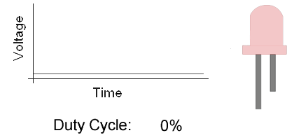

Timer là gì?
================

Timer ở dạng cơ bản nhất là mạch logic đếm lên mỗi một chu kì clock. Nhiều chức năng hơn được triển khai trong phần cứng để hỗ trợ module timer để nó có thể đếm lên hoặc đếm xuống. Nó có thể có Prescaler để chia tần số đầu vào bằng cách lựa chọn một giá trị cụ thể.

Theo hình dưới, một timer 16-bit có thể đếm từ 0 đến 65535. Mỗi chu kì clock, giá trị của timer tăng 1. Và bạn có thể thấy, Prescaler chia tần số Fsys ra trước khi bỏ vào timer.

.. figure:: imagines/timer_01.png
   :align: center
   :alt: Priority
   :scale: 100%

Về cơ bản, khi sử dụng timer, thanh ghi TCNT được tăng thêm 1 mỗi chu kỳ xung nhịp @ tần số sau (Fsys/PSC). Điều này có nghĩa là nếu Fsys là 80MHz & PSC là 1/1024 thì TCNT sẽ tăng thêm 1 sau mỗi 12,8μs. Do đó, nếu bạn khởi động timer để đếm từ 0 cho đến khi nó tràn (ở mức 65535), nó sẽ cung cấp cho bạn tín hiệu ngắt cứ sau 0,839 giây.

Timer có thể hoạt động ở chế độ bộ đếm mà không xác định được nguồn xung nhịp, thực tế đó là tín hiệu bên ngoài. Có thể từ một nút ấn, do đó bộ đếm sẽ tăng lên mỗi cạnh lên hoặc xuống từ lần nhấn nút. 

STM32 Timers Hardware
=====================

Module timer cơ bản
-------------------

Timer cơ bản bao gồm bộ counter 16-bit auto-reload được điều khiển bởi Prescaler có thể lập trình. Chúng có thể được sử dụng làm bộ định thời chung để tạo cơ sở thời gian nhưng chúng cũng được sử dụng đặc biệt để điều khiển bộ chuyển đổi kỹ thuật số sang tương tự (DAC). Trên thực tế, timer được kết nối nội bộ với DAC và có thể điều khiển nó thông qua đầu ra kích hoạt của chúng. Timer hoàn toàn độc lập và không chia sẻ bất kỳ tài nguyên nào.

Các mode của timer
==================

Timer mode
----------

Ở mode timer, timer lấy clock từ nguồn clock nội với tần số đã biết. Do tần số xung clock đã biết, thời gian tràn cũng có thể được tính toán và kiểm soát bởi thanh ghi preload. Mỗi lần timer overflow, timer sẽ báo hiệu cho CPU bằng một ngắt cho biết đã kết thúc khoảng thời gian đã chỉ định.

Chế độ hoạt động này thường được sử dụng để thực hiện một thao tác cụ thể trong từng khoảng thời gian cụ thể. Và để đạt được thời gian và đồng bộ hóa giữa các nhiệm vụ và sự kiện khác nhau trong hệ thống. Nó cũng có thể thay thế độ trễ trong nhiều tình huống khác nhau để hệ thống phản hồi tốt hơn.

.. figure:: imagines/timer_01.png
   :align: center
   :alt: Priority
   :scale: 100%

Counter mode
------------

Ở counter mode, module timer được bấm giờ từ nguồn bên ngoài (timer input pin). Vì vậy, bộ đếm thời gian đếm lên hoặc xuống trên mỗi cạnh lên hoặc cạnh xuống của input từ bên ngoài. Chế độ này thực sự hữu ích trong nhiều trường hợp khi bạn cần triển khai bộ đếm kỹ thuật số mà không cần thăm dò các chân đầu vào hoặc đọc GPIO định kỳ hoặc liên tục làm gián đoạn CPU nếu bạn chọn nối nó với chân EXTI.

Bạn thực sự có thể theo dõi sự khác biệt về giá trị của bộ đếm trong mỗi khoảng thời gian để biết có bao nhiêu xung đã xảy ra hoặc tần số của nó là bao nhiêu. Chế độ như vậy có thể có lợi trong nhiều tình huống như thế này. Và nhiều ví dụ khác sẽ có trong các hướng dẫn sắp tới.

PWM mode
--------

Tại mode PWM, timer lấy nguồn từ clock nội và sản xuất một sóng digital ở chân output - sóng PWM. Bằng các sử dụng output compare resisters (OCR), giá trị thanh ghi của bộ đếm thời gian tăng dần được so sánh liên tục với thanh ghi OCR này. Khi điều kiện xảy ra trạng thái chân output sẽ được đảo ngược cho đến khi hết thời gian à toàn bộ quá trình được lặp lại.

Timer ở mode PWM sẽ tạo ra tín hiệu PWM ở tần số xác định mà người dùng đã chọn. Duty cycle được điều khiển theo chương trình bởi thanh ghi của nó. Độ phân giải PWM bị ảnh hưởng bởi FPWM mong muốn và các yếu tố khác như chúng ta sẽ thấy trong các hướng dẫn dành riêng cho việc tạo PWM.

Timer phải được khởi tạo (initialize) trước khi được sử dụng. Việc khởi tạo đặt giá trị cho expiry function và stop function, đặt trạng thái của timer về 0 và đưa timer về trạng thái dừng.

Timer được bắt đầu bằng cách chỉ định cho nó thời lượng và chu kì. Trạng thái của timer được được đặt về 0, sau đó timer vào trạng thái chạy (running state) và bắt đầu đếm ngược về cho đến khi hết hạn.

Lưu ý rằng thời lượng của timer và các tham số chỉ định độ trễ tối thiểu sẽ trôi qua. Do độ chính xác của hệ thống timer nội (và các tương tác khác có khả năng ảnh hưởng như thời gian delay của ngắt)

Làm thế nào để define một timer?
================================

Một timer được define bằng cách sử dụng một biến kiểu **k_timer**. Sau đó, nó phải được khởi tạo bằng cách gọi **k_timer_init ()**.

Đoạn code phía dưới define và khởi tạo timer:

.. code-block:: c

    #include <zephyr.h>
    struct k_timer my_timer;
    extern void my_expiry_function(struct k_timer *timer_id);

    k_timer_init(&my_timer, my_expiry_function, NULL);

Ngoài ra, một bộ timer có thể được xác định và khởi tạo tại thời điểm biên dịch bằng cách gọi **K_TIMER_DEFINE**.

Đoạn code sau đây có tác dụng tương tự như đoạn code trên:

.. code-block:: c

    #include <zephyr.h>
    K_TIMER_DEFINE(my_timer, my_expiry_function, NULL);

