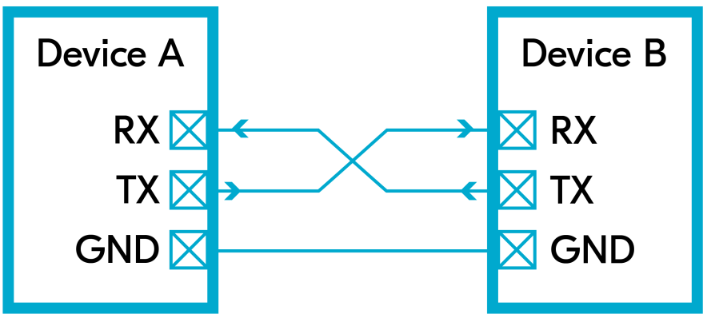
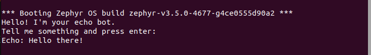

UART
+++++++++++++++++++++++++++++++++++++++++++++
.. contents::
    :local:
    :depth: 2

1. Giới thiệu UART
----------------------------

Tổng quan
======================

UART (Universal Asynchronous Receiver – Transmitter) là một chuẩn giao tiếp truyền nhận bất đồng bộ. Giao thức này hoạt động bằng cách kết nối hai thiết bị tối thiểu ba dây dẫn: một dây để truyền dữ liệu (Tx), một dây để nhận dữ liệu (Rx), một dây để nối GND của hai thiết bị. Chân Tx của thiết bị này sẽ nối với chân Rx của thiết bị kia và ngược lại. 

Dữ liệu được truyền theo từng bit từ thiết bị này sang thiết bị khác. Ưu điểm chính của giao thức truyền thông này là cả hai thiết bị không cần phải có cùng tần số hoạt động.
Mặc dù giao thức UART cho phép hai thiết bị có tần số hoạt động khác nhau giao tiếp dễ dàng, nhưng để đảm bảo cả hai hiểu được thông tin truyền tải, cần phải thiết lập sẵn một tốc độ bit được gọi là **tốc độ baud**. Tốc độ baud này thường được lưu trữ trong bộ nhớ flash của cả hai vi điều khiển để cả hai đều có thể giải mã chính xác các tín hiệu được gửi và nhận.

Nguyên lý hoạt động
======================

Quá trình hoạt động của UART như sau:

- Thiết bị truyền UART sẽ nhận dữ liệu từ bus dữ liệu dưới dạng song song, có thể đến từ CPU, bộ nhớ hoặc vi điều khiển. Sau đó thiết bị sẽ thêm bit bắt đầu, bit chẵn lẻ (tùy chọn) và bit dừng vào dữ liệu, sau đó chuyển đổi dữ liệu từ song song sang nối tiếp để truyền qua chân Tx.
- Khi truyền, dữ liệu được truyền qua cáp nối tiếp đến thiết bị nhận. Ở thiết bị nhận dữ liệu, UART nhận sẽ đọc dữ liệu nối tiếp từng bit tại chân Rx, Sau đó, thiết bị sẽ chuyển đổi dữ liệu từ nối tiếp sang song song và loại bỏ bit bắt đầu, bit chẵn lẻ và bit dừng. Cuối cùng, dữ liệu sẽ được gửi song song sang bus dữ liệu.

.. image:: img/Operation.png
    :align: center

UART truyền dữ liệu theo từng gói (packet). Mỗi gói dữ liệu UART được cấu tạo từ các thành phần sau:

- 1 Bit bắt đầu (Start bit): Tín hiệu luôn ở mức 0, báo hiệu cho thiết bị nhận biết sắp có dữ liệu được truyền đến.
- 5 đến 9 Bit dữ liệu (Data bits): Đây là phần chính của gói, chứa nội dung thông tin cần truyền. Số bit dữ liệu có thể thay đổi tùy thuộc vào cấu hình UART cụ thể.
- Bit kiểm tra tính chẵn lẻ (Parity bit - tùy chọn): Bit này được sử dụng để kiểm tra lỗi truyền trong quá trình truyền dữ liệu. Giá trị của nó được tính dựa trên các bit dữ liệu (chẵn hoặc lẻ) để đảm bảo tính toàn vẹn của thông tin. Tuy nhiên, tùy thuộc vào cấu hình, bit kiểm tra tính chẵn lẻ đôi khi không được sử dụng.
- 1 hoặc 2 Bit dừng (Stop bit): Là tín hiệu mức 1, báo hiệu cho thiết bị nhận biết sự kết thúc của một gói dữ liệu. Có thể sử dụng 1 hoặc 2 bit dừng tùy thuộc vào cấu hình UART.

.. image:: img/DataFrame.png
    :align: center

2. UART setup
----------------------------

Khi thiết lập bất kỳ UART nào, phải tuân theo các bước cơ bản sau:

Bước 1: Cấu hình Device Tree cho UART
==========================================

- File Device Tree có thể được tìm thấy theo đường dẫn: ``zephyrproject/zephyr/boards/...``. 
- Trong dự án này, board sử dụng là STM32F746G_Disco, đường dẫn đến file Device Tree tương ứng: ``zephyrproject/zephyr/boards/arm/stm32f746g_disco.dts``.

.. code-block:: bash

    &usart1 
    {
        pinctrl-0 = <&usart1_tx_pa9 &usart1_rx_pb7>;
        pinctrl-names = "default";
        current-speed = <115200>;
        status = "okay";
    };

- Trong đoạn mã trên, ``&uart1`` chỉ định UART cụ thể (có thể thay đổi tùy thuộc vào thiết bị bạn đang sử dụng), ``current-speed`` đặt tốc độ baud là 115200, và ``status`` được đặt thành "okay" để bật UART.

Bước 2: Yêu cầu Kconfig File cho UART
==========================================

.. code-block::

    CONFIG_SERIAL=y
    CONFIG_UART_INTERRUPT_DRIVEN=y

3. Ví dụ truyền và nhận UART trên console
-------------------------------------------
  
``Code mẫu: zephyr/samples/drivers/uart/echo_bot``

Giới thiệu về chương trình mẫu sử dụng UART
============================================

Chương trình mẫu này trình bày cách sử dụng UART để tạo một bot phản hồi đơn giản. Bot này thực hiện các chức năng sau:

- Sử dụng UART để nhận từng ký tự từ console cho đến khi gặp ký tự kết thúc dòng.
- Sau khi nhận được một dòng dữ liệu đầy đủ, chương trình sẽ gửi lại toàn bộ dòng dữ liệu đó qua UART để hiển thị trên console.

Chương trình mẫu sử dụng polling API để truyền dữ liệu và interrupt-driven API để nhận dữ liệu từ console. Về mặt lý thuyết, các thread có thể làm việc khác trong khi chờ dữ liệu đến.

Giải thích code 
====================
.. code-block:: C

    #define UART_DEVICE_NODE DT_CHOSEN(zephyr_shell_uart) 
    #define MSG_SIZE 32

- Dòng 1 định nghĩa một hằng số có tên ``UART_DEVICE_NODE`` để chỉ định thiết bị UART được sử dụng. Macro ``DT_CHOSEN()`` được sử dụng để chọn thiết bị UART đã được cấu hình trong file Device Tree (DTS).
- Dòng 2 định nghĩa một hằng số ``MSG_SIZE`` với giá trị là 32, cho biết kích thước tối đa của mỗi tin nhắn UART.

.. code-block:: C

    K_MSGQ_DEFINE(uart_msgq, MSG_SIZE, 10, 4);
    static const struct device *const uart_dev = DEVICE_DT_GET(UART_DEVICE_NODE);

- Dòng 1 khởi tạo một hàng đợi tin nhắn với tên ``uart_msgq`` có kích thước mỗi phần tử là ``MSG_SIZE`` byte và có thể chứa tối đa 10 phần tử.
- Dòng 2 khởi tạo một con trỏ tới thiết bị UART đã được chọn bằng cách sử dụng ``DEVICE_DT_GET()`` với tham số là hằng số ``UART_DEVICE_NODE`` đã được định nghĩa trước đó.

.. code-block:: C

    static char rx_buf[MSG_SIZE];
    static int rx_buf_pos;

- khai báo một buffer rx_buf nhận dữ liệu từ UART với kích thước ``MSG_SIZE`` byte.
- khai báo một biến ``rx_buf_pos`` để theo dõi vị trí hiện tại của dữ liệu được nhận trong buffer ``rx_buf``.

.. code-block:: C

        void serial_cb(const struct device *dev, void *user_data)
        {
            uint8_t c;

            if (!uart_irq_update(uart_dev)) 
            {
                return;
            }

            if (!uart_irq_rx_ready(uart_dev)) 
            {
                return;
            }

            /* read until FIFO empty */
            while (uart_fifo_read(uart_dev, &c, 1) == 1) 
            {
                if ((c == '\n' || c == '\r') && rx_buf_pos > 0) 
                {
                    /* terminate string */
                    rx_buf[rx_buf_pos] = '\0';

                    /* if queue is full, message is silently dropped */
                    k_msgq_put(&uart_msgq, &rx_buf, K_NO_WAIT);

                    /* reset the buffer (it was copied to the msgq) */
                    rx_buf_pos = 0;
                } 
                else if (rx_buf_pos < (sizeof(rx_buf) - 1)) 
                {
                    rx_buf[rx_buf_pos++] = c;
                }
            /* else: characters beyond buffer size are dropped */
            }
        }

- Hàm ``serial_cb`` được sử dụng như một callback để xử lý dữ liệu nhận được từ UART.
- Hàm sử dụng vòng lặp while để đọc dữ liệu từ FIFO của UART và lưu trữ vào buffer ``rx_buf``. Vòng lặp này chạy cho đến khi FIFO rỗng.
- Trong vòng lặp, mỗi ký tự được đọc từ UART được kiểm tra xem có phải là ký tự kết thúc dòng (\n hoặc \r) hay không và rx_buf_pos lớn hơn 0. Nếu điều này đúng, ký tự kết thúc chuỗi (\0) được thêm vào buffer rx_buf.
- Sau đó chuỗi được đưa vào hàng đợi tin nhắn ``uart_msgq`` bằng cách sử dụng ``k_msgq_put()``. Sau đó, buffer rx_buf được reset và rx_buf_pos được đặt lại về 0 để chuẩn bị cho việc nhận tin nhắn tiếp theo.
- Nếu không phải là ký tự kết thúc dòng, hàm kiểm tra xem buffer rx_buf đã đầy chưa. Nếu chưa đầy, ký tự được thêm vào buffer rx_buf và rx_buf_pos được tăng lên một.
- Nếu buffer rx_buf đã đầy, các ký tự tiếp theo sẽ bị loại bỏ, vì chúng không thể được lưu trữ trong buffer.

.. code-block:: c

    void print_uart(char *buf)
    {
        int msg_len = strlen(buf);

        for (int i = 0; i < msg_len; i++) {
            uart_poll_out(uart_dev, buf[i]);
        }
    }

- Hàm ``print_uart`` được sử dụng để gửi một chuỗi ký tự qua UART. 
- Trước tiên, hàm tính độ dài của chuỗi ký tự bằng cách sử dụng hàm ``strlen(buf)`` và lưu vào biến msg_len.
- Hàm sử dụng một vòng lặp for để lặp qua từng ký tự trong chuỗi buf và gửi chúng qua UART một cách tuần tự.
- Trong vòng lặp, mỗi ký tự trong chuỗi buf được gửi qua UART bằng cách sử dụng hàm ``uart_poll_out(uart_dev, buf[i])``.
- Sau khi tất cả các ký tự trong chuỗi đã được gửi đi, hàm kết thúc và quay trở lại nơi được gọi.

.. code-block:: c

    int main(void)
    {
        char tx_buf[MSG_SIZE];

        if (!device_is_ready(uart_dev)) 
        {
            printk("UART device not found!");
            return 0;
        }

        /* configure interrupt and callback to receive data */
        int ret = uart_irq_callback_user_data_set(uart_dev, serial_cb, NULL);

        if (ret < 0) 
        {
            if (ret == -ENOTSUP) 
            {
                printk("Interrupt-driven UART API support not enabled\n");
            } 
            else if (ret == -ENOSYS) 
            {
                printk("UART device does not support interrupt-driven API\n");
            } 
            else 
            {
                printk("Error setting UART callback: %d\n", ret);
            }
            return 0;
        }
        uart_irq_rx_enable(uart_dev);

        print_uart("Hello! I'm your echo bot.\r\n");
        print_uart("Tell me something and press enter:\r\n");

        /* indefinitely wait for input from the user */
        while (k_msgq_get(&uart_msgq, &tx_buf, K_FOREVER) == 0) 
        {
            print_uart("Echo: ");
            print_uart(tx_buf);
            print_uart("\r\n");
        }
        return 0;
    }

- Khai báo một mảng ``tx_buf`` có kích thước ``MSG_SIZE``, được sử dụng để lưu trữ dữ liệu nhận được từ hàng đợi và sau đó gửi lại qua UART.
- Hàm ``device_is_ready(uart_dev)`` được sử dụng để kiểm tra xem thiết bị UART có sẵn sàng không. Nếu thiết bị không sẵn sàng, thông báo lỗi được in ra và chương trình kết thúc.
- Sau đó, thiết lập callback và cấu hình ngắt để nhận dữ liệu từ UART bằng cách sử dụng hàm ``uart_irq_callback_user_data_set()``. Nếu không thể thiết lập callback, các thông báo lỗi tương ứng được in ra.
- Hàm ``uart_irq_rx_enable()`` được sử dụng để  kích hoạt chế độ nhận dữ liệu từ UART.
- Sau khi hoàn tất bước thiết lập, chương trình sẽ gửi chuỗi chào mừng qua UART bằng cách sử dụng hàm ``print_uart()``. Hai thông điệp "Hello! I'm your echo bot." và "Tell me something and press enter:" được gửi để thông báo với người dùng.

- Trong vòng lặp while, chương trình chờ nhận dữ liệu từ hàng đợi ``uart_msgq`` bằng cách sử dụng hàm ``k_msgq_get()``. Khi nhận được dữ liệu từ hàng đợi, chương trình gửi lại dữ liệu này qua UART để tạo ra chức năng echo.
- Sau khi chương trình nhận được dữ liệu từ hàng đợi và gửi lại, nó tiếp tục lặp lại quá trình này để chờ dữ liệu tiếp theo.

4. Giao tiếp với UART sử dụng Minicom
-----------------------------------------

Bước 1: Cài đặt  Minicom
=============================

Nếu minicom chưa được cài đặt trên máy Linux của bạn, hãy sử dụng apt-get để cài đặt.

.. code-block:: bash

    sudo apt-get install minicom

Bước 2: Mở console bằng Minicom
================================
- Kết nối board Zephyr với một máy tính chạy hệ điều hành Linux bằng cách sử dụng cáp USB. Khi kết nối board Zephyr với máy tính, hệ điều hành Linux sẽ tự động nhận diện nó như một thiết bị nối tiếp CDC_ACM (Communication Device Class, Abstract Control Model). 
- CDC_ACM là một loại giao thức chuẩn được sử dụng để kết nối các thiết bị như modems, serial ports, v.v., qua cổng USB.
- Để xem đầu ra từ console của board Zephyr, bạn cần sử dụng một chương trình terminal như Minicom. Command ``minicom -D /dev/ttyACM0`` sẽ mở Minicom và thiết lập kết nối với thiết bị nối tiếp được nhận diện bởi Linux ở địa chỉ ``/dev/ttyACM0``.
- Trong trường hợp này, ``/dev/ttyACM0`` là đường dẫn của thiết bị nối tiếp CDC_ACM được Linux gán cho board Zephyr.

.. code-block:: bash

    minicom -D /dev/ttyACM0

.. note::

    Các đối số sau đây có thể được sử dụng để điều chỉnh hành vi của Minicom từ dòng lệnh:

    - **-b <baudrate>**: Đối số này cho phép chỉ định tốc độ baud cho cổng serial được sử dụng bởi thiết bị ngoại vi.
    - **-D <device_name>**: Đối số này cho phép chỉ định tên thiết bị cho cổng serial được sử dụng.
    - **-h**: Đối số này hiển thị một danh sách các đối số mà Minicom chấp nhận, giúp bạn hiểu rõ cách sử dụng các tùy chọn khác của Minicom.

Bước 3: Cách tìm Device Dev Path trên Linux
====================================================

- Mở terminal bằng Ctrl + Alt + T, sau đó nhập dòng lệnh dưới vào.

.. code-block:: bash

    for sysdevpath in $(find /sys/bus/usb/devices/usb*/ -name dev); do
    (
        syspath="${sysdevpath%/dev}"
        devname="$(udevadm info -q name -p $syspath)"
        [[ "$devname" == "bus/"* ]] && exit
        eval "$(udevadm info -q property --export -p $syspath)"
        [[ -z "$ID_SERIAL" ]] && exit
        echo "/dev/$devname - $ID_SERIAL"
    )
    done

- Các "Port" đang sử dụng sẽ hiện ra trên terminal.
  
.. code-block:: bash

    /dev/ttyACM0 - STMicroelectronics_STM32_STLink_0668FF485157717867163038
    /dev/sda - MBED_microcontroller_0668FF485157717867163038-0:0
    /dev/input/event13 - SONIX_M87_keyboard
    /dev/input/event16 - SONIX_M87_keyboard
    /dev/input/event14 - SONIX_M87_keyboard
    /dev/input/event12 - SONIX_M87_keyboard
    /dev/input/event15 - SONIX_M87_keyboard
    /dev/input/mouse3 - SONIX_M87_keyboard
    /dev/input/event11 - SONIX_M87_keyboard
    /dev/input/event7 - Logitech_USB_Receiver
    /dev/input/mouse2 - Logitech_USB_Receiver
    /dev/video3 - Azurewave_USB2.0_HD_IR_UVC_WebCam_200901010001
    /dev/video2 - Azurewave_USB2.0_HD_IR_UVC_WebCam_200901010001
    /dev/video1 - Azurewave_USB2.0_HD_IR_UVC_WebCam_200901010001
    /dev/video0 - Azurewave_USB2.0_HD_IR_UVC_WebCam_200901010001

- Hiện tại, board STM32 đang được kết nối qua cổng ``/dev/ttyACM0``. Sử dụng cách này để mở đúng console cần giao tiếp UART.

5. Bài tập
-----------

**Điều khiển LED thông qua UART**

- ``Code mẫu: exercise/UART/index.rst``
