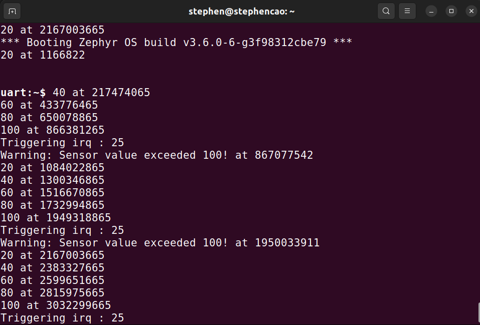
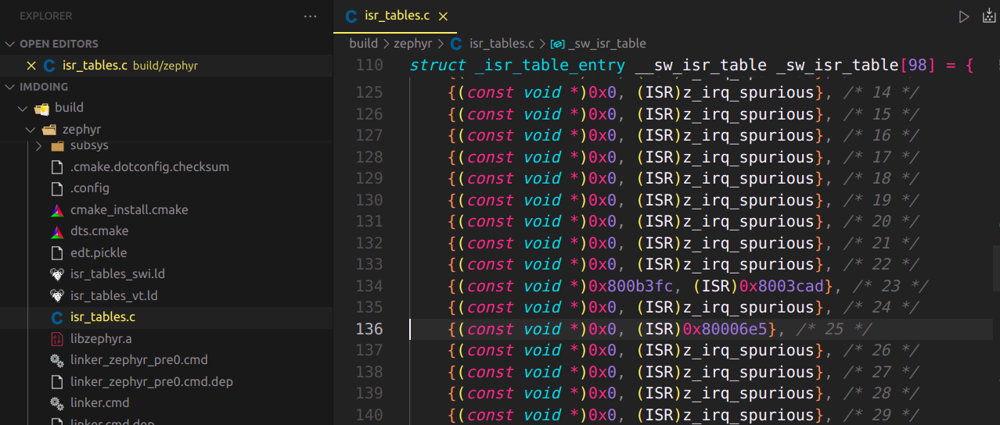
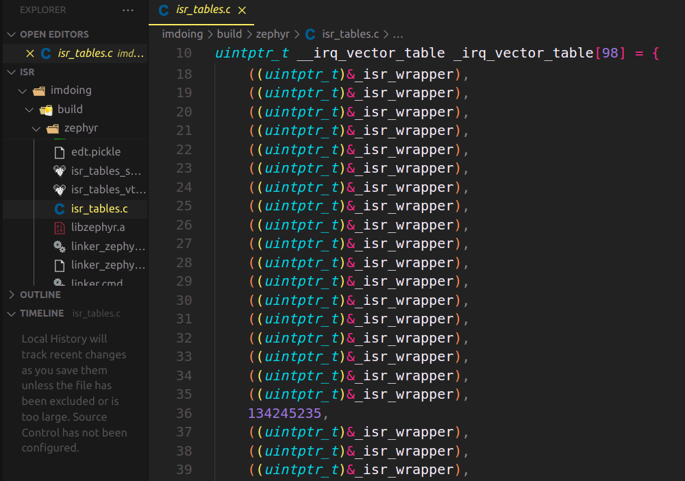
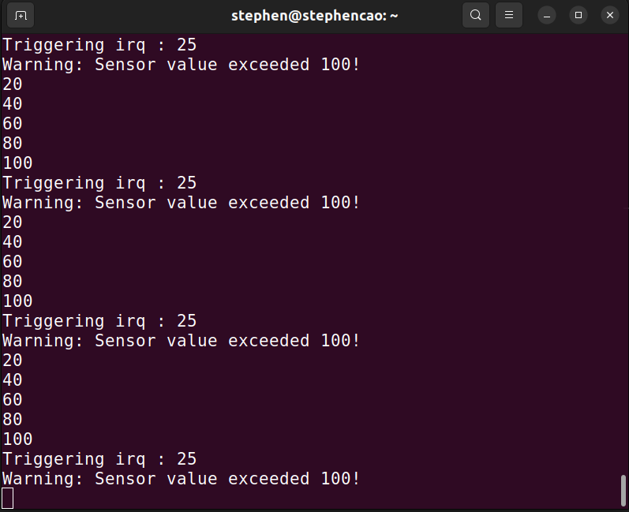
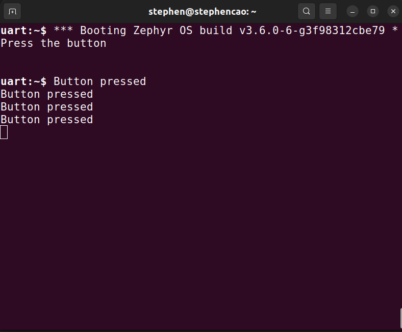
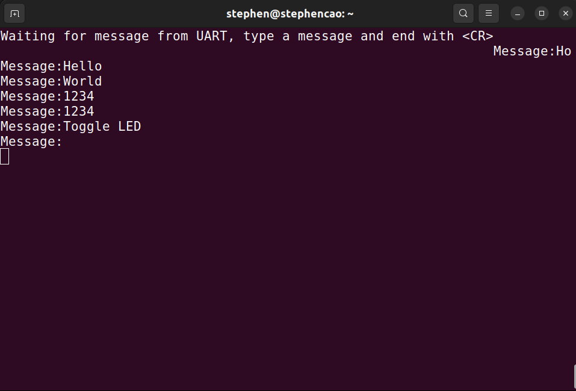

Thực hành
=========

1. Bảng Vector Ngắt - ex_vector
-------------------------------

Thử tạo Ngắt Thông thường hoặc Ngắt Trực tiếp. Sau đó xác nhận rằng Ngắt Thông thường hoặc Ngắt Trực tiếp có hay không xuất hiện trong file Config khi Compile, xuất hiện trong trình Debug. 

.. Note:: Device được đăng ký với mã là 25

**Đối với Ngắt Thông thường:**

|table|

**Đối với Ngắt Trực tiếp:** 

|table2| 

2. Kích hoạt một Ngắt - ex_trigger
---------------------------------- 

Thông thường, các Ngắt của Zephyr đã được API hóa một cách chặt chẽ. Vậy nên muốn kích hoạt Ngắt của Zephyr phải đảm bảo thiết bị/ngoại vi rườm rà. Tuy nhiên, trong bài tập dưới đây, hàm ``trigger_irq(isr_device_code)`` sẽ được cung cấp, thuộc thư viện ``#include "interrupt_util.h"``, với tác dụng giúp chúng ta kích hoạt ngắt để xem kết quả. 

.. Note:: Cho thư viện ``interrupt_util.h``

.. literalinclude:: ./include/interrupt_util.h

**Viết chương trình, mỗi giây tăng giá trị biến đếm từ 0, lên thêm 20,
nếu đạt đủ 100, kích hoạt ngắt và quay về 0** 

|trigger|

3. Zero Latency Interrupt - ex_zerolatency
------------------------------------------

Ở bài này, chúng ta hãy so sánh việc sử dụng Zero Latency Interrupt có gì khác biệt. Cho kiểu dữ liệu ``PRIu32`` thuộc thư viện ``#include <inttypes.h>`` và hàm ``k_cycle_get_32()`` có tác dụng xác định chu kì máy hiện tại mà Kernel đã trải qua. 

**Thực hiện thêm vào chương trình ví dụ trên các hàm và kiểu dữ liệu được nhắc tới, sau đó kích hoạt Zero Latency Interrupt để xem có sự khác biệt hay không**

   

4. Ngắt GPIO - ex_gpioisr
-------------------------

Thực hiện ví dụ này trên Board STM32F746G Discovery. Trên Board có một Button, đặt tên định danh trong Device Tree là ``sw0``. Hãy xác thực điều này. Sau đó: 

**Viết chương trình thực hiện ngắt GPIO, mỗi khi bấm nút SW0, Console sẽ hiển thị “Pressed”**

|button|

5. Ngắt UART - ex_uartisr
-------------------------

UART có trong Zephyr có ít nhất 3 cách để giao tiếp. Ở ví dụ này, hãy sử dụng cách giao tiếp với UART thông qua các API Ngắt với 1 ví dụ điển hình. 

**Sử dụng hàm** ``uart_irq_callback_user_data_set`` ``uart_irq_rx_enable`` **để viết chương trình hiển thị tin nhắn gửi qua cổng UART sau phím Enter <CR>, qua mỗi tin nhắn nhận được, LED sẽ được Toggle** 

|uart|

