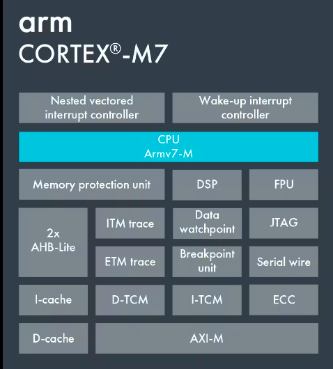
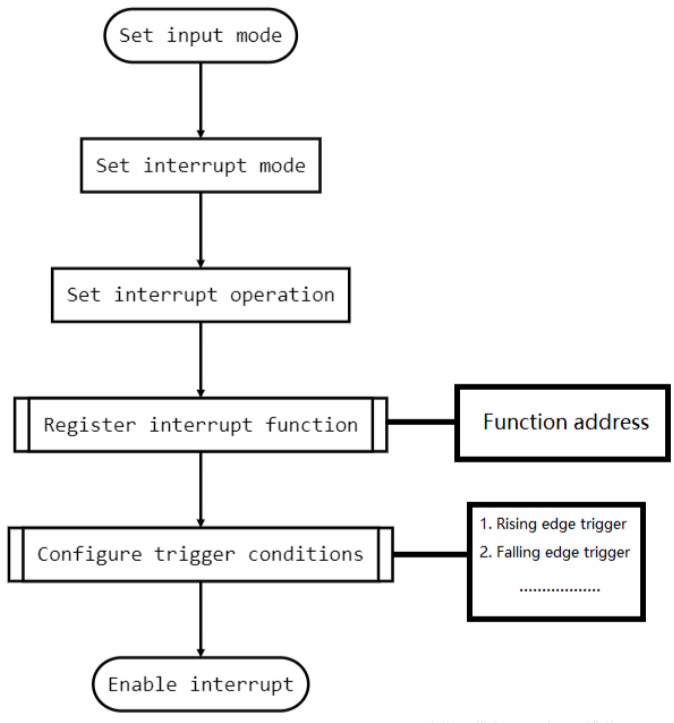

$$
\begin{array}{|c|c|c|}
\hline
   \textbf{''} & \textbf{ Tiêu đề } & \textbf{Thư mục cha} \\ 
\hline
   \text{''} & \text{7.2 Ngắt Ngoại vi} & \text{7. Ngắt - Interrupts} \\
\hline
\end{array}
$$
# Ngắt Ngoại vi GPIO - External Interrupt GPIO
## Tóm tắt phần cứng
Board phát triển được sử dụng làm ví dụ là STM32F746G Discovery:


| NSX | BOARD          | Kernel       |
|----|-------------------|-------------------|
| ST | STM32F746G_DISCO | CORTEX-M7 |



Bộ điều khiển ngắt:

| Đối tượng |           | 
|----|-------------------|
| NVIC (Nested Vectored Interrupt Controller) | Bộ điều khiển ngắt Vector ngắt lồng nhau | 

* NVIC hỗ trợ các ngắt lồng nhau, nghĩa là khi một ngắt được kích hoạt, nó hỗ trợ nhiều cấp độ ngắt. Mỗi ngắt có một mức độ ưu tiên. CPU thực hiện các ngắt khác nhau tùy theo mức độ ưu tiên.
* Nếu một ngắt khác xuất hiện trong khi đang thực hiện ngắt hiện tại, CPU sẽ xác định mức ưu tiên ngắt nào cao hơn mức ưu tiên ngắt hiện đang được thực thi, nếu lớn hơn mức ưu tiên ngắt hiện tại thì nó sẽ nhảy để thực hiện ngắt mới, nếu không sẽ bị treo. Đợi quá trình thực hiện ngắt này kết thúc quá trình xử lý tiếp theo.
* NVIC được kết nối chặt chẽ với CPU, CPU có thể giao tiếp với NVIC thông qua bus để biết trạng thái của ngắt hiện tại nhằm đảm bảo ngắt nào sẽ được thực thi.
* Thông tin về ngắt luôn được cung cấp trong tài liệu liên quan đến cấu trúc Chip:


Sau khi Biên dịch chương trình, cơ bản chúng ta không cần phải quan tâm đến việc sử dụng trình xử lý ngắt nào, vì API hệ thống đã được hợp nhất để quản lý các trình xử lý ngắt này. Chẳng hạn đối với ngắt thuộc ARM có 2 chế độ:
- FIQ - IRQ Ngắt nhanh
- IRQ - Ngắt thường

Và sau đó để kích hoạt, cần sử dụng các Lệnh:

| Lệnh |      Mô tả     | 
|----|-------------------|
| cpsid i | Tắt ngắt IRQ | 
| cpsie i | Kích hoạt ngắt IRQ | 
| cpsid f | Tắt ngắt FIQ | 
| cpsie f | Kích hoạt ngắt FIQ | 

## Tổng quan về GPIO
- Zephyr Sử dụng `.dts`, một kiểu Device Tree tương tự như các OS nhân Linux để đóng gói và quản lý các phần cứng cấp thấp. Hầu như các phần cứng cấp thấp đều khó có thể tiếp cận bởi lớp trên. Từ đó, Zephyr cung cấp các API để dễ dàng giao tiếp với các phần cứng cấp thấp này, giúp việc phát triển trở nên đơn giản hơn.
- Nếu chúng ta muốn thực hiện tạo Ngắt GPIO, trước tiên chúng ta cần phải biết tên GPIO, không phải là địa chỉ. Với Flow đơn thuần, chúng ta phải thông qua GPIO để lấy địa chỉ và cấu hình các thanh ghi chức năng trong đó, nhưng với Zephyr, chỉ cần thông qua tên GPIO đã được khai báo trong `.dts` kèm theo các API là chúng ta đã có thể cấu hình được.


- Còn việc tạo Ngắt, khai báo Ngắt, không khác gì so với Flow như bình thường: 
`Cấu hình thanh ghi GPIO →  Kích hoạt Ngắt.`
- Quy trình cụ thể là: 
`Cài đặt chế độ chân INPUT → Cài đặt Mode ngắt → Cấu hình điều kiện kích hoạt → Đăng ký LVT → Kích hoạt ngắt`
- Về trường hợp sử dụng GPIO trong ngắt:
> Ví dụ mình muốn phát triển driver cho một cảm biến để phát hiện những thay đổi trong cảm biến, nhưng cảm biến này sẽ chỉ nhận dữ liệu trong một số điều kiện nhất định. Chẳng hạn như Cảm biến hồng ngoại sẽ chỉ xuất dữ liệu khi có phản hồi từ tia hồng ngoại. Nếu không, không có tín hiệu. Vậy chúng ta có phải viết chương trình để theo dõi liên tục xem có dữ liệu đến từ GPIO? 
> Cách tiếp cận này rất vô lý, vì nó sẽ ngốn tài nguyên của CPU. Tốt hơn hết là để CPU ngủ hoặc làm một số việc khác, và chỉ thức dậy khi cờ tràn và tạo ra một ngắt. Tốt hơn nên giám sát ở trạng thái vòng lặp while. Đây là thiết kế hợp lý nhất để CPU thực hiện công việc.

## Phân tích Device Tree
Zephyr sẽ gọi một số lệnh để phân tích file Device Tree `.dts` để tạo tệp cấu trúc phần cứng mà chương trình sẽ chạy trên nó.
Ví dụ: Board STM32F746G Discovery, trong Zephyr có định dạng file `.dts`:
```shell
cd ~
find . -iname "stm32f746g_disco"
```
Trong file này, chúng ta có thể thấy các tên gọi đại diện cho các ngoại vi:
```bat
#include <st/f7/stm32f746Xg.dtsi>
#include <st/f7/stm32f746nghx-pinctrl.dtsi>
#include "arduino_r3_connector.dtsi"
#include <zephyr/dt-bindings/input/input-event-codes.h>
#include <zephyr/dt-bindings/memory-attr/memory-attr.h>
#include <zephyr/dt-bindings/memory-attr/memory-attr-arm.h>
```
```bat
        aliases {
                led0 = &green_led_1;
                sw0 = &user_button;
                spi-flash0 = &n25q128a1;
        };
```
Các file này thường là một tập hợp các file cấu trúc, nếu tìm sâu hơn `st/f7/stm32f746Xg.dtsi`:

```bat
#include <mem.h>
#include <st/f7/stm32f746.dtsi>

/ {
        soc {
                flash-controller@40023c00 {
                        flash0: flash@8000000 {
                                reg = <0x08000000 DT_SIZE_K(1024)>;
                        };
                };
        };
};
```
Qua đó, chúng ta có thể thấy, các file này thường giống nhau bởi nó có chung một họ Chip
```bat
#include <st/f7/stm32f7.dtsi>
...
```
Nó chứa tệp `stm32f7.dtsi`, xác định tất cả thông tin phần cứng của họ F7
```bat
#include <arm/armv7-m.dtsi>
#include <zephyr/dt-bindings/clock/stm32f7_clock.h>
#include <zephyr/dt-bindings/i2c/i2c.h>
#include <zephyr/dt-bindings/gpio/gpio.h>
#include <zephyr/dt-bindings/pwm/pwm.h>
#include <zephyr/dt-bindings/pwm/stm32_pwm.h>
#include <zephyr/dt-bindings/dma/stm32_dma.h>
#include <zephyr/dt-bindings/adc/stm32f4_adc.h>
#include <zephyr/dt-bindings/reset/stm32f2_4_7_reset.h>
#include <zephyr/dt-bindings/adc/adc.h>
#include <zephyr/dt-bindings/memory-controller/stm32-fmc-sdram.h>
#include <zephyr/dt-bindings/memory-attr/memory-attr.h>
#include <zephyr/dt-bindings/memory-attr/memory-attr-arm.h>
#include <freq.h>
...
		exti: interrupt-controller@40013c00 {
			compatible = "st,stm32-exti";
			interrupt-controller;
			#interrupt-cells = <1>;
			#address-cells = <1>;
			reg = <0x40013c00 0x400>;
			num-lines = <16>;
			interrupts = <6 0>, <7 0>, <8 0>, <9 0>,
				     <10 0>, <23 0>, <40 0>;
			interrupt-names = "line0", "line1", "line2", "line3",
					  "line4", "line5-9", "line10-15";
			line-ranges = <0 1>, <1 1>, <2 1>, <3 1>,
				      <4 1>, <5 5>, <10 6>;
		};
		pinctrl: pin-controller@40020000 {
			compatible = "st,stm32-pinctrl";
			#address-cells = <1>;
			#size-cells = <1>;
			reg = <0x40020000 0x2400>;

			gpioa: gpio@40020000 {
				compatible = "st,stm32-gpio";
				gpio-controller;
				#gpio-cells = <2>;
				reg = <0x40020000 0x400>;
				clocks = <&rcc STM32_CLOCK_BUS_AHB1 0x00000001>;
			};

			gpiob: gpio@40020400 {
				compatible = "st,stm32-gpio";
				gpio-controller;
				#gpio-cells = <2>;
				reg = <0x40020400 0x400>;
				clocks = <&rcc STM32_CLOCK_BUS_AHB1 0x00000002>;
			};

			gpioc: gpio@40020800 {
				compatible = "st,stm32-gpio";
				gpio-controller;
				#gpio-cells = <2>;
				reg = <0x40020800 0x400>;
				clocks = <&rcc STM32_CLOCK_BUS_AHB1 0x00000004>;
			};
...
```
Chúng ta có thể có được tất cả các khai báo phần cứng của họ F7 này, và vì vậy nên:
```bat
        gpio_keys {
                compatible = "gpio-keys";
                user_button: button {
                        label = "User";
                        gpios = <&gpioi 11 GPIO_ACTIVE_HIGH>;
                        zephyr,code = <INPUT_KEY_0>;
                };
        };

```
Phần khai báo `.dts` này định nghĩa một cổng GPIOs trỏ đến thuộc tính `gpioi`, Active mức cao. Điều này cho biết, muốn khích hoạt nó phải cho ra tín hiệu mức cao.
## Các cấu trúc dữ liệu liên quan đến Device Tree
Cấu trúc dữ liệu thường được sử dụng nhất là `gpio_dt_spec`, là một cấu trúc đặc biệt khởi tạo thông tin được khai báo trong `.dts`. Cấu trúc này được khởi tạo ở `zephyr/include/drivers`
```C
struct gpio_dt_spec{
    const struct device *port;
    gpio_pin_t pin;
    gpio_dt_flags_t dt_flags;
};
```
| Tên biến |      Kiểu     |       Tác dụng     |
|----|-------------------|-------------------|
| port | device* | Trỏ tới bộ điều khiển Device sau khi khởi tạo `dtc`| 
| pin | gpio_pin_t | Trỏ tới Pin định danh của Device |  
| dt_flags | gpio_dt_flags_t | Thuộc tính Device | 

Cấu trúc `device*` của `*port` mang các thuộc tính sau:
```C
struct device {
    const char *name;
    const void *config;
    const void *api;
    struct device_state * const state;
    void * const data;
    const device_handle_t *const handles;
#ifdef CONFIG_PM_DEVICE
    pm_device_control_callback_t pm_control;
    struct pm_device * const pm;
#endif
};
```

| Tên biến |      Kiểu     |       Tác dụng     |
|----|-------------------|-------------------|
| api | const void * | Địa chỉ tới cấu trúc API | 
| config | const void * | Địa chỉ tới thông tin cấu hình |  
| data | void * const | Địa chỉ dữ liệu riêng Device | 
| handles | device_handle_t* | Con trỏ tới hàm liên kết Device  | 
| name | const char * | Tên Device được cấu hình trong `dts` | 
| pm | pm_device * | Con trỏ tới dữ liệu PM Device | 
| pm_control | pm_device_control_callback_t | Chức năng Power Management | 
| state | device_state * | Địa chỉ thanh ghi trạng thái Device | 

Nói chung, khi cần sử dụng Bus hoặc các Ngoại vi được đề cập trong `.dts` thì chúng ta cần sử dụng `gpio_dt_spec`

## Khởi tạo thiết bị
Zephyr cung cấp các Hàm Macro để khởi tạo Device - Clone từ Device Tree.
```C
DT_ALIAS
DT_GPIO_LABEL
DT_GPIO_PIN
DT_GPIO_FLAGS
GPIO_DT_SPEC_GET_OR
```
Được khai báo tại: `zephyr/include/drivers/gpio.h`
Các hàm Macro này sẽ thu các tham số khởi tạo Device **trong quá trình biên dịch**. Trước khi thực sự biên dịch, Zephyr sẽ gọi 1 tập lệch đặc biệt, thông qua các Macro này để phân tích các tệp DeviceTree và tạo tệp `.h` tương ứng với các sửa đổi.
1. `DT_ALIAS`

| Nguyên hàm |   Đối số     |    Tác dụng   |
|----------|-------------------|-------------------|
|  `DT_ALIAS(alias)` | `alias` | Lấy cấu trúc thông tin Device thông qua Alias|
```C
/*dtc
 leds {
        compatible &#61; &#34;gpio-leds&#34;;
        green_led_1: led_1 {
            gpios &#61; &lt;&amp;gpioi 1 GPIO_ACTIVE_HIGH&gt;;
            label &#61; &#34;User LD1&#34;;
        };
    };
 
    aliases {
        led0 &#61; &amp;green_led_1;
    };
*/
DT_ALIAS(led0) 
```
2. `DT_GPIO_LABEL`

| Nguyên hàm |   Đối số     |    Tác dụng   |
|----------|-------------------|-------------------|
|  `DT_GPIO_LABEL(node_id, gpio_pha)` | Node ID, Đối tượng GPIO | Lấy tên/nhãn GPIO|
```C
/*dtc 
 leds {
        compatible &#61; &#34;gpio-leds&#34;;
        green_led_1: led_1 {
            gpios &#61; &lt;&amp;gpioi 1 GPIO_ACTIVE_HIGH&gt;;
            label &#61; &#34;User LD1&#34;;
        };
    };
 
    aliases {
        led0 &#61; &amp;green_led_1;
    };
*/
DT_GPIO_LABEL(green_led_1,gpios) //gpioi
```
3. `DT_GPIO_PIN`

| Nguyên hàm |   Đối số     |    Tác dụng   |
|----------|-------------------|-------------------|
|  `DT_GPIO_PIN(node_id, gpio_pha)` | Node ID, Đối tượng GPIO | Lấy chỉ số GPIO|
```C
/*dtc 
 leds {
        compatible &#61; &#34;gpio-leds&#34;;
        green_led_1: led_1 {
            gpios &#61; &lt;&amp;gpioi 1 GPIO_ACTIVE_HIGH&gt;;
            label &#61; &#34;User LD1&#34;;
        };
    };
 
    aliases {
        led0 &#61; &amp;green_led_1;
    };
*/
DT_GPIO_PIN(green_led_1,gpios) //gpioi
```
4. `DT_GPIO_FLAGS`

| Nguyên hàm |   Đối số     |    Tác dụng   |
|----------|-------------------|-------------------|
|  `DT_GPIO_FLAGS(node_id, gpio_pha)` | Node ID, Đối tượng GPIO | Lấy thuộc tính GPIO|
```C
/*dtc 
*/
DT_GPIO_FLAGS(green_led_1,gpios) //gpioi
```

5. `GPIO_DT_SPEC_GET_OR`

| Nguyên hàm |   Đối số     |    Tác dụng   |
|----------|-------------------|-------------------|
|  `GPIO_DT_SPEC_GET_OR(node_id, prop, defaut_value)` | Node ID, Đối tượng GPIO, chỉ số | Lấy thuộc tính GPIO và khởi tạo chúng dưới dạng gpio_dt_spec|
```C
/*dtc 
*/
static struct gpio_dt_spec gpio_led &#61; GPIO_DT_SPEC_GET_OR(DT_ALIAS(led0), gpios,{0})
```

## Sử dụng API GPIO
```C
gpio_pin_configure_dt
gpio_pin_interrupt_configure_dt
gpio_init_callback
gpio_add_callback
gpio_pin_configure
gpio_pin_set
```
Giá trị trả về: 0 nếu thành công, khác 0 nếu thất bại.

| Nguyên hàm |   Đối số     |    Tác dụng   |
|----------|-------------------|-------------------|
|  `gpio_pin_configure_dt(struct gpio_dt_spec *st, int FLAGS)` | Cấu trúc `dtc` Device, Thuộc tính cài đặt | Đặt thuộc tính GPIO|
|  `gpio_pin_interrupt_configure_dt(struct gpio_dt_spec *st, int FLAGS)` | Cấu trúc dtc Device, Thuộc tính cài đặt |**Đặt ngắt GPIO**|
|  `gpio_init_callback(struct gpio_dt_spec * st, void (*func)(const struct device*, struct gpio_callback*, unit32_t), _addr, bit_pin)` | Cấu trúc khởi tạo Device, Hàm dịch vụ ngắt, Chân Pin chuyển đổi Macro bit | **Đặt chức năng ngắt GPIO**|
|  `gpio_add_callback(struct device *port, struct gpio_callback *st)` | Cấu trúc Device, Cấu trúc lưu thuộc tính cài đặt |**Thêm dịch vụ ngắt**|
|  `gpio_pin_configure(struct device * port, pin , int FLAGS)` | Cấu trúc Device, Pin, Thuộc tính | Đặt thuộc tính cho GPIO|
|  `gpio_pin_set(struct device *port, pin, value int)` | Cấu trúc thiết bị, chân Pin, giá trị | Đặt giá trị GPIO |

Các thuộc tính có thể lựa chọn tham số

| Tham số |   Mang thuộc tính    | 
|----------|-------------------|
|GPIO_INPUT |Chế độ Input |
|GPIO_OUTPUT |Chế độ Output|
GPIO_DISCONNECTED| Tắt chế độ đầu vào và đầu ra 
GPIO_OUTPUT_INIT_LOW |Đặt trạng thái ban đầu đầu ra ở mức thấp 
GPIO_OUTPUT_INIT_HIGH |Đặt trạng thái ban đầu đầu ra ở mức cao 
GPIO_OUTPUT_INIT_LOGICAL| Khởi tạo đầu ra theo mức logic 
GPIO_OUTPUT_LOW |Định cấu hình chân GPIO làm đầu ra và khởi tạo nó ở mức thấp 
GPIO_OUTPUT_HIGH |Định cấu hình chân GPIO làm đầu ra và khởi tạo nó ở mức cao. 
GPIO_OUTPUT_INACTIVE| Định cấu hình chân GPIO làm đầu ra và khởi tạo nó thành logic 0. 
GPIO_OUTPUT_ACTIVE| Định cấu hình chân GPIO làm đầu ra và khởi tạo nó thành logic 1. 
GPIO_INT_DISABLE |Vô hiệu hóa ngắt pin GPIO 
GPIO_INT_LEVELS_LOGICAL | Mức Logic ngắt
GPIO_INT_EDGE | Ngắt cạnh
GPIO_INT_LOW_0 |Ngắt kích hoạt bởi mức thấp hoặc mức logic 0 
GPIO_INT_HIGH_1 |Ngắt kích hoạt bởi mức cao hoặc mức logic 1 
GPIO_INT_EDGE_RISING |Định cấu hình ngắt GPIO để kích hoạt ở cạnh tăng của chân 
GPIO_INT_EDGE_FALLING| Định cấu hình ngắt GPIO để kích hoạt ở cạnh tăng hoặc giảm của chân
GPIO_INT_EDGE_FALLING |Định cấu hình ngắt GPIO để kích hoạt ở cạnh rơi của chân 
GPIO_INT_EDGE_BOTH |Định cấu hình ngắt GPIO để kích hoạt ở cạnh tăng hoặc giảm của chân
GPIO_INT_LEVEL_LOW |Định cấu hình ngắt GPIO để kích hoạt khi chân ở mức thấp
GPIO_INT_LEVEL_HIGH |Định cấu hình ngắt GPIO để kích hoạt khi mức cao
GPIO_INT_EDGE_TO_INACTIVE |Định cấu hình ngắt GPIO để kích hoạt khi trạng thái chân thay đổi thành mức logic 0 
GPIO_INT_EDGE_TO_ACTIVE |Định cấu hình ngắt GPIO để kích hoạt khi trạng thái chân thay đổi thành mức logic 1
GPIO_INT_LEVEL_INACTIVE| Định cấu hình ngắt GPIO để kích hoạt ở mức logic chân 0 v
GPIO_INT_LEVEL_ACTIVE |Định cấu hình ngắt GPIO để kích hoạt ở mức logic chân 1 
GPIO_INT_DEBOUNCE |Kích hoạt tính năng chống rung pin GPIO

## Ngắt GPIO

1. Tạo chức năng dịch vụ ngắt

```C
void irq_func(const struct device *dev,struct gpio_callback* cb,uint32_t pins){
    printk("okay\n");
}
```
Từ các đối số đã nhắc tới ở trên, `void (*func)(const struct device *,struct gpio_callback* ,uint32_t)`
```c
*dev : Trỏ tới Device
 cb  : Thuộc tính dịch vụ ngắt
 pin : Chỉ số chân ngắt hiện tại
```

2. Cấu hình ngắt
```C

gpio_pin_configure_dt(&gpio, GPIO_INPUT);
gpio_pin_interrupt_configure_dt(&gpio, GPIO_INT_EDGE_TO_ACTIVE);
gpio_init_callback(&gpio_data, my_isr, BIT(gpio.pin));
gpio_add_callback(gpio.port, &gpio_data);
gpio_pin_configure(gpio.port, PIN, GPIO_OUTPUT_ACTIVE | 0);
```
Từng bước như sau:
>* Cấu hình ngắt để là chế độ input
>* Cấu hình GPIO ngắt để kích hoạt khi trạng thái chân thay đổi thành mức logic 1 và kích hoạt nó
>* Gán hàm ngắt với chân pin và lưu cấu trúc khởi tạo vào gpio_data
>* Thêm cấu trúc vừa gán vào bảng vector
>* Cấu hình chế độ của chân pin
