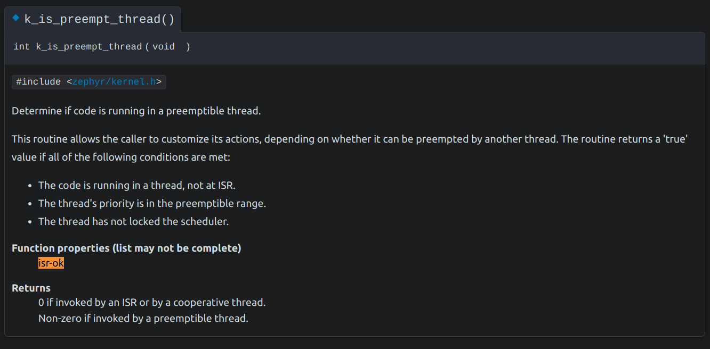
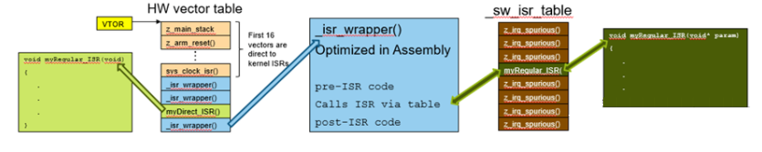

<!-- ---
layout: post
title: '7.1 Introduction'
parent: '7. Interrupts'
--- -->

$$
\begin{array}{|c|c|c|}
\hline
   \textbf{''} & \textbf{ Tiêu đề } & \textbf{Thư mục cha} \\ 
\hline
   \text{''} & \text{7.1 Giới thiệu về Ngắt} & \text{7. Ngắt - Interrupts} \\
\hline
\end{array}
$$

# Giới thiệu về Ngắt - Interrupt
## Tổng quát
1. **Ngắt** (interrupt) - IRQ (Interrupt Request) là quá trình dừng chương trình chính đang chạy để ưu tiên thực hiện một chương trình khác, chương trình này được gọi là ***chương trình phục vụ ngắt*** (ISR – Interrupt Service Routine).
2. Trong các quá trình ngắt, ta phân biệt thành 2 loại: **ngắt cứng** và **ngắt mềm**. 
   - **Ngắt mềm** là ngắt được gọi bằng một lệnh trong chương trình ngôn ngữ máy.
   - Khác với ngắt mềm, **ngắt cứng** không được khởi động bên trong máy tính mà do các linh kiện điện tử tác đông lên hệ thống.
3. **Hoạt động:** Khi thực hiện lệnh gọi ngắt, CPU sẽ tìm kiếm trong bảng vector ngắt địa chỉ của chương trình phục vụ ngắt. Người sử dụng cũng có thể xây dựng môt chương trình cơ sở như các chương trình xử lý ngắt. Sau đó, các chương trình khác có thể gọi ngắt ra để sử dụng. Một chương trình có thể gọi chương trình con loại này mà không cần biết địa chỉ của nó.
## Ngắt trong Zephyr - Interrupt API Zephyr
1. *Kernel của Zephyr cung cấp một chương trình dịch vụ ngắt mặc định cho tất cả các ngắt chưa được sử dụng.* Nghĩa là người dùng **có thể không cần phải định nghĩa ngắt cho một số trường hợp cụ thể,** nhưng nếu một sự kiện ngắt xảy ra mà không có dịch vụ ngắt tương ứng được định nghĩa, hệ thống sẽ phát sinh lỗi.
Điều này nhấn mạnh tính chắc chắn và sự ổn định trong việc xử lý ngắt, đảm bảo rằng hệ thống không bỏ qua bất kỳ sự kiện ngắt nào mà không được xử lý.
2. *Các ngắt có thể lồng ghép nhau với điều kiện đáp ứng với Kernel:*
   - Có Stack riêng cho các ngắt
   - Dung lượng Stack đủ lớn để lồng nhau
3. *Thực thi Thread chỉ tiếp tục sau khi hoàn thành ISR* 
4. *Ngắt mềm:*
   -  Các ngắt thông thường được quản lý bằng ngắt mềm
   - Dùng bảng vector ngắt mềm - Một điểm khá mới so với các RTOS khác

> **A.** Một số lưu ý về ***Hàm dịch vụ ngắt*** :
> - Ngắt là một kiểu thực thi không đồng bộ
> - Ưu tiên quay về Thread hiện tại
> - Nên nhanh chóng thực thi để đảm bảo hệ thống có thể dự đoán, ít lỗi, ít bị trễ
> - Nên giảm tải quá trình xử lý đến ngắt trong 1 Thread
> - Sau khi ISR hoàn thành, hệ thống chuyển sang "Helper thread"[^1] dựa trên độ ưu tiên của Thread. Helper thread này có thể được kích hoạt bằng cách sử dụng một loại kernel object như FIFO, LIFO hoặc semaphore để xử lý các công việc liên quan đến ngắt.


[^1]: *Là một Thread trong hệ thống mà được sử dụng để xử lý công việc bổ sung mà không cần phải chạy trong ISR. Thường thì các Thread này có độ ưu tiên thấp hơn so với Thread chính để tránh làm gián đoạn quá trình chính quá nhiều.*

> **B.** Trong Zephyr, hầu hết các API của Kernel chỉ có thể được sử dụng trong Thread, không thể sử dụng trong ISR (Interrupt Service Routine). Tuy nhiên, những API Kernel có thể được sử dụng trong ISR thường có thuộc tính là **`isr_ok`**. Điều này giúp người phát triển nhận biết được những API nào có thể an toàn để sử dụng trong ngữ cảnh của ISR, đồng thời giảm thiểu nguy cơ lỗi và tăng tính ổn định của hệ thống.
> Trong trường hợp một thường trình có thể được gọi bởi cả Thread và ISR, kernel cung cấp hàm **`k_is_in_isr()`** để cho phép thường trình thay đổi hành vi của nó tùy thuộc vào việc nó đang thực thi như một phần của Thread hay là một phần của ISR.


## Các loại Ngắt trong Zephyr

1. ISR Thông Thường:
 >- Được gọi bằng thủ tục dịch vụ ngắt mềm và không thể chạy trực tiếp.
 >- Đơn giản và dễ sử dụng.
2. ISR Trực tiếp - Dynamic:
 >- Không sử dụng quy trình dịch vụ ngắt mềm. Đăng ký trực tiếp vào **bảng Vector ngắt** phần cứng.
 >- Độ trễ thấp nhưng có nhiều hạn chế, ví dụ như không thể truyền tham số.
3. ISR độ trễ bằng 0 - Zero Latency:
 >- Nó có độ trễ thấp nhất
 >- Có mức ưu tiên ngắt cao nhất và không bị ảnh hưởng bởi khóa ngắt
 >- Nó có thể khai báo từ ISR Thông thường hoặc ISR Trực tiếp 

## Bảng Vector Ngắt của Zephyr
Sau các loại Ngắt, kế đến là một khái niệm khá mới được Zephyr thêm vào, đó chính là **Vector Ngắt**.
**1. Bảng Vector Ngắt phần cứng:**
 - 16 vị trí đầu tiên được cố định dành cho các dịch vụ của Kernel.
 - Nếu các vị trí khác chưa được đăng ký thì chương trình dịch vụ ngắt chung `_isr_wrapper()` sẽ được điền vào.
  
**2. Bảng Vector Ngắt phần mềm:**
 - Chứa các hàm xử lý ngắt phần mềm đã được đăng ký cùng với các tham số liên quan.
 - Tất cả các vị trí trong bảng này đều có thể được đăng ký bởi các dịch vụ ngắt `z_irq_spurious()`.
   
**3. Vai trò của Dịch vụ ngắt chung `_isr_wrapper()`:**
- Đây là hàm đầu tiên được gọi khi một ngắt được kích hoạt. Nó có trách nhiệm trích xuất địa chỉ và các tham số liên quan từ **bảng Vector Ngắt phần mềm**, sau đó chuyển quyền điều khiển tới hàm xử lý ngắt tương ứng.

**4. Ngắt trực tiếp:**
- Đây là loại ngắt được kết nối trực tiếp với **bảng Vector Ngắt phần cứng**. Khi một ngắt trực tiếp được kích hoạt, hàm xử lý ngắt tương ứng được thực thi ngay lập tức mà không thông qua bất kỳ phương tiện trung gian nào

>Dưới đây là Logic việc đăng ký dịch vụ ngắt



## Ngắt Thông thường - Regular Interrupt
- **Ngắt Thông thường được tạo ngay khi biên dịch chương trình**

Được tạo bởi hàm `IRQ_CONNECT()`, sau đó phải được kích hoạt bằng cách gọi hàm `irq_enable()`
> Lưu ý:  `IRQ_CONNECT()` bản thân nó không phải là một hàm C, không thao tác bên trong hàm. Vì vậy, tất cả đối số của nó cần phải được cung cấp ngay thời điểm gọi.
```C
IRQ_CONNECT(irq_p, priority_p, isr_p, isr_param_p, flags_p)
```
Trong đó
```
irq_p                  <Số hiệu của ngắt/Số hiệu đăng kí thiết bị>
priority_p                     <Ưu tiên của ngắt/Mức ưu tiên>
isr_p                               <Hàm dịch vụ ngắt>
flags_p                 <Cờ ngắt[Không phải là cờ xác định ngắt]>
```
Một ví dụ về khởi tạo Ngắt Thông thường như sau:
```C
#define MY_DEV_IRQ 24 /* Thiết bị sử dụng IRQ #24 */
#define MY_DEV_PRIO 2 /* Mức ưu tiên của ngắt là 2 */
/* Đối số trỏ tới thiết bị*/
#define MY_ISR_ARG DEVICE_GET(my_device)
#define MY_IRQ_FLAGS 0 /* Cờ IRQ - Tính chất của Ngắt */

void my_isr(void *arg)
{
   ... /* Dịch vụ Ngắt */
}

void my_isr_installer(void)
{
   ... 
   IRQ_CONNECT(MY_DEV_IRQ, MY_DEV_PRIO, my_isr, MY_ISR_ARG, MY_IRQ_FLAGS);
   irq_enable(MY_DEV_IRQ);
   ...
}
```
Phương pháp tạo Ngắt trên, lúc nào cũng sẽ được tạo khi biên dịch. Đương nhiên, Zephyr cũng hỗ trờ đăng ký bằng cách gọi hàm `irq_connect_dynamic()` trong thời gian chạy, nhưng `CONFIG_DYNAMIC_INTERRUPTS=y` cần để được cấu hình.
## Ngắt Trực tiếp - Direct Interrupt:
Các Ngắt Thông thường trong Zephyr vẫn chịu một số giới hạn của Kernel, kèm theo đó vẫn có độ trễ xử lý nhất định, khó có thể chấp nhận được với một số trường hợp yêu cầu phản ứng thời gian thực:
> * Tham số đầu vào ISR được chuyển thẳng đến ISR
> * Nếu có sử dụng **`Power Management`**, khi hệ thống đang ở trạng thái chờ, tất cả phần cứng sẽ cần phải được đánh thức trước khi ISR được thực thi, điều này đối với Ngắt Thông thường khó đạt được.
> * Một số kiến trúc yêu cầu cần có **`Interrupt Stack`**, nhưng một số kiến trúc khác lại có thể xử lý điều này chỉ cần phần cứng
> * Sau khi phục vụ Ngắt, OS cần phải thực hiện một số Logic để có thể lập lịch lại tiến trình

Vì vậy, Zephyr hỗ trợ các ngắt được gọi là **`Direct`**, được cài đặt thông qua `IRQ_DIRECT_CONNECT()`. Những Ngắt Trực tiếp được này có yêu cầu một số cài đặt đặc biệt, phần cứng hỗ trợ và một số tính năng bị lược bớt so với Ngắt Thông thường.

> Xem thêm: [Direct Interrupt]([http://https://vi.wikipedia.org/wiki/Markdown](https://docs.zephyrproject.org/latest/kernel/services/interrupts.html#c.IRQ_DIRECT_CONNECT))

Có thể nói cách khác, `IRQ_DIRECT_CONNECT()` thường được sử dụng cho các Ngắt phần cứng, trong khi `IRQ_CONNECT()` thường được sử dụng cho các ngắt mềm. `IRQ_DIRECT_CONNECT()` có thể cung cấp hiệu suất tốt hơn trong một số trường hợp, đặc biệt là khi cần đạt được thời gian đáp ứng thấp hơn và giảm thiểu độ trễ.
Một ví dụ khởi tạo **Ngắt Trực tiếp** tương tự ví dụ trước:

```C
#define MY_DEV_IRQ 24 /* Thiết bị đăng ký IRQ #24 */
#define MY_DEV_PRIO 2 /* Mức ưu tiên 2 */
/* Đối số là một con trỏ tới thiết vị */
#define MY_IRQ_FLAGS 0 /* Cờ IRQ */

ISR_DIRECT_DECLARE(my_isr)
{
   do_stuff();
   ISR_DIRECT_PM(); /* PowerManagement được thực hiện sau khi ngắt dịch vụ để có độ trễ tốt nhất */
   return 1; 
}

void my_isr_installer(void)
{
   ...
   IRQ_DIRECT_CONNECT(MY_DEV_IRQ, MY_DEV_PRIO, my_isr, MY_IRQ_FLAGS);
   irq_enable(MY_DEV_IRQ);
   ...
}
```

## Ngắt có độ trễ bằng 0 - Zero Latency Interrupt
Như đã đề cập trước đó, loại ngắt thứ 3 này có thể là **Ngắt Trực tiếp** hoặc là **Ngắt Thông thường**. Nói một cách khác, cách triển khai của nó tương tự như hai loại trên, điểm khác biệt duy nhất là Cờ Ngắt `flags_q` được truyền vào là `IRQ_ZERO_LATENCY`, để chỉ ra rằng, đây là một Ngắt được khởi tạo với tính chất không có độ trễ.
>Tại sao lại gọi là không có độ trễ?

Cơ bản là trong quá trình thiết kế chương trình, chúng ta thường mặc định có khóa ngắt trong Code, để đảm bảo rằng Code sẽ không bị chồng chập, gián đoạn bởi Ngắt. Tuy nhiên, điều này có thể dẫn đến việc tăng độ trễ của hệ thống, điều này thường không chấp nhận được đối với một số trường hợp ứng dụng đòi hỏi thời gian phản hồi thấp.

Ở đây, vai trò của **Ngắt không độ trễ** được thể hiện. Nó chạy ở một ưu tiên không bị khóa, tất nhiên cần bật `CONFIG_ZERO_LATENCY_IRQS=y` để kích hoạt. Như vậy, khi một ngắt được kích hoạt, hàm xử lý ngắt tương ứng có thể được thực thi ngay lập tức, giảm đáng kể độ trễ của ngắt.

***
***Dựa trên các Ngắt Tổng quát trên, Zephyr cung cấp các API của các Ngắt Ứng dụng, được tạo nên bởi các hàm trên, bao gồm:***
- **Ngắt Ngoại vi [GPIO, Sensor,v.v..]**
- **Ngắt Timer**
- **Ngắt UART**
**Và một số  Ngắt đặc biệt khác như WatchDog, ADC, v.v.**
***

## Ứng dụng - Ngắt Ngoại vi - GPIO
> Xem: [GPIO Interrupt](./gpio_interrupt.md)

## Ứng dụng - Ngắt Timer
> Xem: [Timer Interrupt](./timer_interrupt.md)

## Ứng dụng - Ngắt UART
> Xem: [UART Interrupt](./uart_interrupt.md)


## Vô hiệu hóa một Ngắt
Trong một số tình huống, có thể cần thiết cho Thread hiện tại ngăn không cho ISRs (Interrupt Service Routines - các hàm xử lý ngắt) thực thi, bởi nó đang thực hiện các hoạt động đòi hỏi thời gian chính xác hoặc phần quan trọng.
Một Thread có thể tạm thời ngăn tất cả các xử lý IRQ trong hệ thống bằng cách sử dụng một khóa IRQ. Khóa này có thể được áp dụng ngay cả khi nó đã hoạt động, do đó các hàm có thể sử dụng nó mà không cần biết nó đã hoạt động hay chưa. Thread phải mở khóa IRQ của mình cùng số lần đã khóa trước khi ngắn này có thể được xử lý lại bởi Kernel trong khi Thread đang chạy.
> **Lưu ý**:
 Khóa IRQ là cụ thể cho từng . Nếu Thread A khóa ngắt sau đó thực hiện một hoạt động cho phép Thread B chạy (ví dụ: cung cấp một semaphore hoặc ngủ trong N mili giây), thì khóa IRQ của Thread không còn áp dụng sau khi Thread A được đổi ra. Điều này có nghĩa là các ngắt có thể được xử lý trong khi Thread B đang chạy trừ khi Thread B cũng đã khóa ngắt bằng khóa IRQ riêng của mình.
 Khi Thread A trở thành Thread hiện tại một lần nữa, Kernel tái thiết lập khóa IRQ của Thread A. Điều này đảm bảo Thread A sẽ không bị gián đoạn cho đến khi nó đã mở khóa IRQ của mình một cách rõ ràng.

 Nói cách khác, một Thread có thể tạm thời vô hiệu hóa một IRQ cụ thể. IRQ phải được kích hoạt sau đó để cho phép ISR thực thi.
 > **Lưu ý**:Vô hiệu hóa một IRQ ngăn tất cả các Thread trong hệ thống bị gián đoạn bởi ISR liên quan, không chỉ là Thread đã vô hiệu hóa IRQ.


