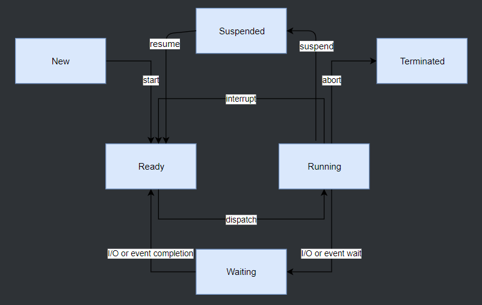
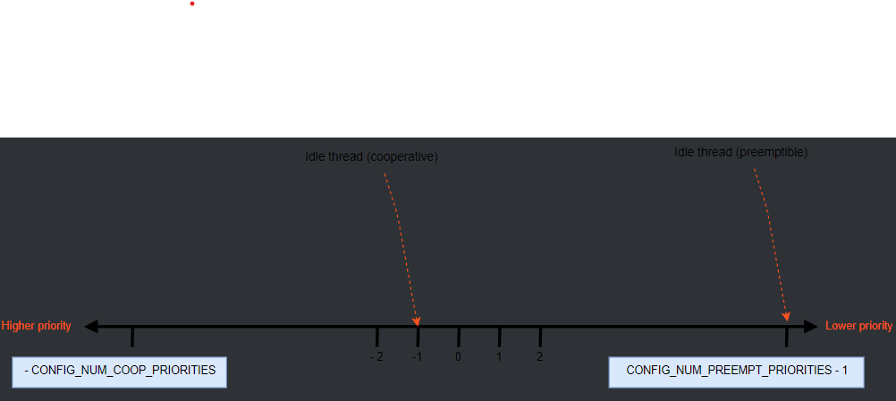

.. zephyr_tutorial documentation master file, created by
   sphinx-quickstart on Thu Feb 29 15:58:28 2024.
   You can adapt this file completely to your liking, but it should at least
   contain the root `toctree` directive.

Thread in Zephyr
++++++++++++++++++++++

Lifecycle
===================

Thread Creation
------------------
Thread cần phải được tạo trước khi sử dụng. Hạt nhân (Kernel) sẽ khởi tạo khối điều khiển luồng cũng như một đầu của ngăn xếp. Phần còn lại của ngăn xếp sẽ không được khởi tạo.

Điều chỉnh độ trễ ban đầu ``K_NO_WAIT`` sẽ khiến Kernel bắt đầu thực thi luồng. Ngoài ra, hạt nhân có thể trì hoãn việc thực thi bằng các điều chỉnh giá trị thời gian trễ.

Kernel cho phép huỷ bỏ quá trình trĩ hoãn trước khi bắt đầu thực thi. Không thể huỷ nếu luồng đã bắt đầu, luồng khi đã bị huỷ thời gian trễ cần phải được tạo lại để sử dụng.

Thread Termination
------------------
Khi Thread được bắt đầu, nó thường thực thi vĩnh viễn. Tuy nhiên, Thread có thể được kết thúc quá trình thực thi một cách đồng bộ bằng các quay về hàm điểm vào của nó.

Thead kết thúc có trách nhiệm giải phóng mọi tài nguyên được chia sẻ mà nó có thể sở hữu trước khi hoạt động trở lại, vì Kernel không thể tự lấy lại chúng.

Thread có thể tạm dừng cho đến khi có một Thread khác kết thúc. Điều này thực hiện bằng API ``k_thread_join()``. Việc này chặn Thread gọi cho đến hết thời gian chờ, Thread đích sẽ tự thoát hoặc huỷ bỏ (do lệnh ``k_thread_abort()`` hoặc xảy ra lỗi).

Lưu ý rằng Thread cần phải được kết thúc hoàn toàn, nếu không sẽ ra chạy đua trong việc hoàn thành tín hiệu của nhiều Thread.

Thread Aborting
------------------

Thread có thể kết thúc quá trình thực thi bằng một cách không đồng bộ bằng cách huỷ bỏ. Kernel tự động huỷ bỏ một Thread nếu Thread gây ra lỗi. Một Thread cũng có thể huỷ bỏ bởi một Thread khác (hoặc bởi chính nó) bằng cách gọi ``k_thread_abort()``. Thông thường nên tự kết thúc Thread đó. Kernel sẽ không tự lấy lại tài nguyên thuộc sở hữu của Thread bị huỷ bỏ..

Thread Suspension
------------------

Hàm k_thread_suspend() có thể sử dụng để tạm dừng bất kỳ Thread nào bao gồm cả Thread đang gọi. Việc tạm dừng không có tác dụng bổ sung.

Để xoá việc tạm dừng phải để một Thread khác gọi hàm k_thread_resume().

Thread State
======================

Một Thread có một hoặc nhiều yếu tố ngăn cản việc thực thi được gọi là chưa sẵn sàng và không thể được chọn làm luồng hiện tại.

Các yếu tố làm cho một Thread chưa sẵn sàng:
   * Thread chưa được bắt đầu.
   * Đang chờ Kernel thực thi một thao tác khác.
   * Thread đang chờ.
   * Thread bị đình chỉ.
   * Thread bị chấm dứt hoặc huỷ bỏ.

Thread Stack Object
======================

Mỗi Thread yêu cầu một bộ đêm ngăn xếp riêng để CPU đẩy tài nguyên vào. Tuỳ vào cấu hình, một số ràng buộc phải đáp ứng:
   * Có thể thêm bộ nhớ riêng dành cho cấu trúc quản lý bộ nhớ.
   * Nếu tính năng phát hiện tràn ngăn xếp được bật, một vùng quản lý bộ nhớ được bảo vệ ghi nhỏ ngay trước bộ đêm ngăn xếp để phát hiện tràn.
   * Nếu không gian người dùng được bật, một ngăn xếp nâng cao có kích thước cố định riêng phải được dành riêng để xử lý các cuộc gọi hệ thống.
   * Nếu không gian người dùng được bật, ngăn xếp phải có kích thước và căn chỉnh phù hợp sao cho vùng bảo vệ bộ nhớ có thể được lập trình chính xác.

Các ràng buộc căn chỉnh khá hạn chế. Do đó, portable code không thể đơn giản chuyển bộ đệm ký tự tuỳ ý tới ``k_thread_create()``. Các macro đặc biệt tồn tại để khởi tạo các ngăn xếp có tiền là ``K_KERNEL_STACK`` và ``K_THREAD_STACK``.

Kernel-only Stacks
------------------

Nếu biết rằng một luồng sẽ không bao giờ chạy trong chế độ người dùng hoặc ngăn xếp đang được sử dụng cho mục đích khác, thì tốt nhất nên xác định ngăn xếp bằng cách sử dụng ``K_KERNEL_STACK``.

Nếu ``CONFIG_USERSPACE`` không được bật, bộ macro ``K_THREAD_STACK`` có tác dụng giống hệ với macro ``K_KERNEL_STACK``.

Thread Stacks
------------------

Nếu ngăn xếp được biết cần để lưu lác Thread của người dùng không thể xác định thì hãy định nghĩa stack với macro ``K_THREAD_STACK``. Thread stack ở định nghĩa tốn nhiều bộ nhớ hơn.

Thread Priorities
======================

Mức độ ưu tiên của Thread là một giá trị nguyên có thể âm. Giá trị ưu tiên càng thấp sẽ có mức độ ưu tiên càng cao. Giá trị ưu tiên ban đầu có thể thay đổi sau khi Thread được bắt đầu.

Ví dụ:
   * Thread A có giá trị ưu tiên là 4
   * Thread B có giá trị ưu tiên là 6
   * Thread C có giá trị ưu tiên là -3

=>	Mức độ ưu tiên của các Thread là: C > A > B.

Scheduler phần biệt thành hai loại thread dựa trên mức độ ưu tiên:
   * cooperative thread có giá trị ưu tiên âm. Khi trở thành current thread, cooperative thread sẽ luôn là current thread cho đến khi nó chuyển sang trạng thái unready.
   * preemptible thread có giá trị ưu tiên không âm. Khi trở thành current thread, preemptible thread có thể bị thay thế bất kì lúc bởi cooperative thread hoặc preemptible thread có độ ưu tiên cao hơn hoặc bằng vào trạng thái ready.

.. toctree::
   :maxdepth: 2
   :caption: Contents:

Indices and tables
==================

* :ref:`genindex`
* :ref:`modindex`
* :ref:`search`
